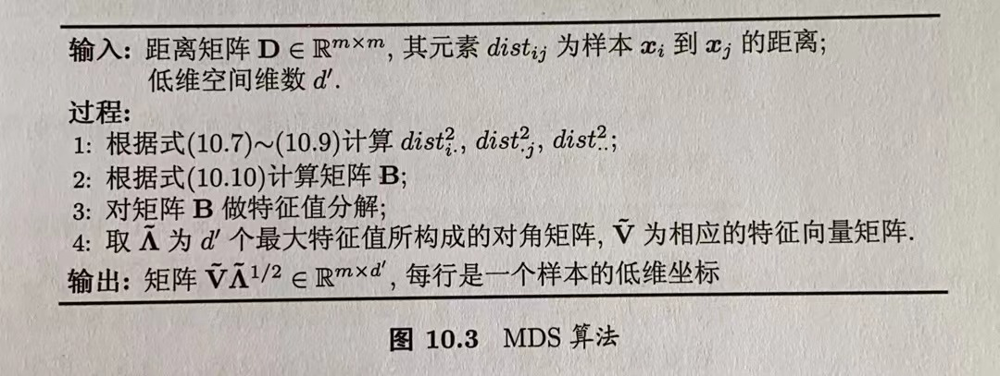
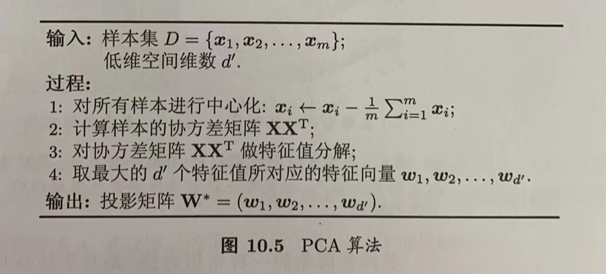
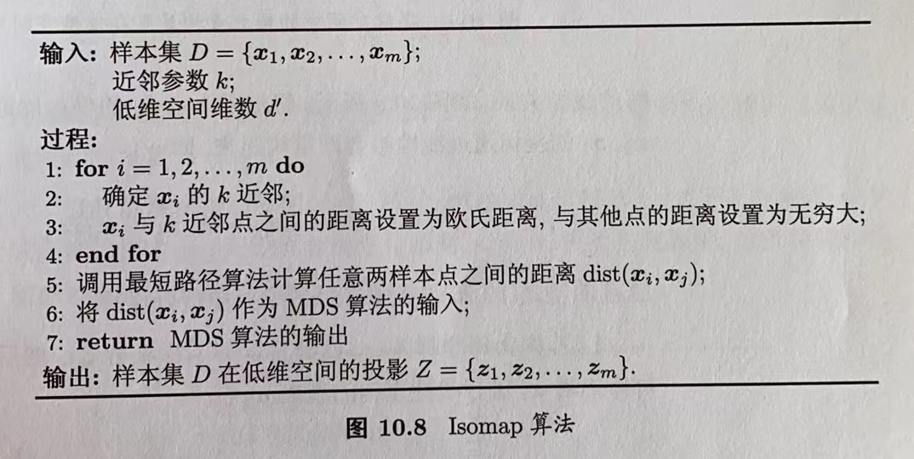

# 第10章 降维与度量学习

## 目录

-   [10.1 k近邻学习](#101-k近邻学习)
-   [10.2 低维嵌入](#102-低维嵌入)
-   [10.3 主成分分析](#103-主成分分析)
-   [10.4 核化线性降维](#104-核化线性降维)
-   [10.5 流形学习](#105-流形学习)
-   [10.6 度量学习](#106-度量学习)

## 10.1 $k$近邻学习

$k$近邻($k$-Nearest Neighbor，kNN)学习是一种常用的监督学习方法，其工作机制：给定测试样本，基于某种距离度量找出训练集中与其最靠近的$k$个训练样本，然后基于这$k$个“邻居”的信息来进行预测。在分类任务中可使用“投票法”，选择这$k$个样本中出现最多的类别标记作为预测结果；在回归任务中可使用“平均法”，将这$k$个样本的实值输出标记的平均值作为预测结果；还可基于距离远近进行加权平均或加权投票，距离越近的样本权重越大。

给定测试样本$x$，若其最近邻样本为$z$，则最近邻分类器出错的概率就是$x$与$z$类别标记不同的概率，即

$P(err)=1-\sum_{c\in y}P(c|x)P(c|z)$      (1)

该公式的解释：首先计算对于每个可能的类别$c$，给定$x$的情况下，$c$被正确分类的概率，记为$P(c|x)$；然后，计算在选择最近邻样本$z$后，$c$被正确分类的概率，记为$P(c|z)$；最后，计算出类别标签不同的情况下，最近邻分类器出错的概率，通过计算$P(err) = 1 - ∑_{c\in y}P(c|x)P(c|z)$来得到。

假设样本独立分布，且对任意$x$和任意小正数$\delta$，在$x$任意近的$\delta$距离范围内总能找到式1中的训练样本$z$。令$c^*=argmax_{c\in y}P(c|x)$表示贝叶斯最优分类器的结果，有

$P(err)=1-\sum_{c\in y}P(c|x)P(c|z)\\ \ \ \ \ \ \  \ \ \ \ \  \ \ \ \simeq 1-\sum_{c\in y}P^2(c|x)\\ \ \ \ \ \ \  \ \ \ \ \  \ \ \ \leq 1-P^2(c^*|x)\\ \ \ \ \ \ \  \ \ \ \ \  \ \ \ =(1+P^2(c^*|x))(1-P^2(c^*|x))\\ \ \ \ \ \ \  \ \ \ \ \  \ \ \ \leq 2\times (1-P^2(c^*|x))$      (2)

由式2可以看到，最近邻分类器的泛化错误率不超过贝叶斯最优分类器的错误率的两倍。

## 10.2 低维嵌入

上一节讨论基于假设：任意$x$和任意小正数$\delta$，在$x$任意近的$\delta$距离范围内总能找到式1中的训练样本$z$，即训练样本的采样密度足够大，或称为“密采样”。这个假设在现实任务中**很难满足**。并且现实应用中属性维数经常成千上万，要满足的密采样条件所需的样本数目是无法达到的天文数字。另外，许多学习方法都涉及距离计算，而高维空间会给距离计算带来很大的麻烦。

事实上，在高维情形下出现的数据样本稀疏、距离计算难得问题，是所有机器学习方法啊都面临的严重障碍，即“维数灾难”。

解决该问题的一个重要途径是降维，通过某种数学变换将原始高维属性空间转变为一个低维“子空间”。

下面是一个经典的降维方法-多维缩放（MDS），使原始空间中样本之间的距离在低维空间中得以保持。

算法描述：

假定$m$个样本在原始空间中的距离矩阵为$D\in R^{m×m}$，其第$i$行$j$列的元素$dist_{ij}$为样本$x_i$和$x_j$的距离。目标是获得样本在$d{'}$维空间的表示$Z\in R^{d'×m},d'≤d$，且**任意两个样本在**$d{'}$**维空间中的欧式距离等于原始空间中的距离**，即$||z_i-z_j||=dist_{ij}$。

令$B=Z^TZ\in R^{m\times m}$，其中$B$为降维后样本的内积矩阵，$b_{ij}=z_i^Tz_j$，有

$dist^2_{ij}=||z_i||^2+||z_j||^2-2z_i^Tz_j=b_{ii}+b_{jj}-2b_{ij}$     (3)

令降维后的样本$Z$被中心化，即$\sum_{i=1}^mz_i=0$。显然，矩阵B的行与列之和均为0，即$\sum_{i=1}^mb_{ij}=\sum_{j=1}^mb_{ij}=0$。易知

$\sum_{i=1}^mdist^2_{ij}=tr(B)+mb_{jj}$     (4)

$\sum_{j=1}^mdist^2_{ij}=tr(B)+mb_{jj}$     (5)

$\sum_{i=1}^m\sum_{j=1}^mdist^2_{ij}=2mtr(B)$     (6)

其中$tr(B)=\sum_{i=1}^m||z_i||^2$，令

$dist_{i·}^2=\frac{1}{m}\sum_{j=1}^mdist_{ij}^2$    (7)

$dist_{·j}^2=\frac{1}{m}\sum_{i=1}^mdist_{ij}^2$    (8)

$dist_{··}^2=\frac{1}{m^2}\sum_{i=1}^m\sum_{j=1}^mdist_{ij}^2$    (9)

由上式可得

$b_{ij}=-\frac{1}{2}(dist_{ij}^2-dist_{i·}^2-dist_{·j}^2+dist_{··}^2)$    (10)

由此可通过降维前后保持不变距离矩阵D求取内积矩阵B。

对矩阵B做特征值分解，$B=V\Lambda V^T$，其中$\Lambda =diag(\lambda_1,\lambda_2,...,\lambda_d)$为特征值构成的对角矩阵，$\lambda_1≥lambda_2≥...≥\lambda_d$，$V$为特征向量矩阵。假定其中有${d*}$个非零特征值，它们构成对角矩阵$\lambda_*=diag(\lambda_1,\lambda_2,...,\lambda_{d*})$，令$V_*$表示相应的特征矩阵向量，则$Z$可表达为

$Z=\Lambda_*^{\frac{1}{2}}V_*^T$     (11)

现实中，为了有效降维，往往仅需降维后的距离与原始空间中的距离尽可能接近，而不必严格相等，于是可取$d'<<d$个最大特征值构成对角矩阵$\tilde{\Lambda} =diag(\lambda_1,\lambda_2,...,\lambda_{d'})$，$\tilde{V}$表示相应的特征向量矩阵，则$Z$可表达为

$Z=\tilde{\Lambda}^{\frac{1}{2}}\tilde{V}^T$     (12)

## 10.3 主成分分析

主成分分析（Principal Component Analysis，PCA）是最常用的一种降维方法。

正交属性空间是指在统计学核机器学习中用于描述数据的一组相互正交的属性或特征.正交属性意味着它们在统计意义上是无关的，彼此之间没有线性相关性。将数据映射到正交属性空间，可以更好地理解和分析数据的特征，同时也可以减少特征之间的冗余信息。正交属性空间的一个常见应用是主成分分析（PCA）。该方法通过线性变换将原始数据映射到一个正交属性空间中，使得新的特征（主成分）之间尽可能地无关。这样可以减少数据的维度，并找到数据中的主要成分。

对于正交属性空间中的样本点，如何用一个超平面对所有样本进行恰当地表达？

-   最近重构性：样本点到这个超平面的距离都足够近
-   最大可分性：样本点在这个超平面上的投影尽可能分开

从最近重构性来推导：假定数据样本进行了中心化，即$\sum_ix_i=0$；再假定投影变换后得到的新坐标系为$\{w_1,w_2,...,w_d\}$，其中$w_i$是标准正交基向量，$||w_i||_2=1$，$w_i^Tw_j=0(i≠j)$。若丢弃新坐标系中的部分坐标，即将维度降低到$d'<d$，则样本点$x_i$在低维坐标系中的投影是$z_i=(z_{i1},z_{i2},...,z_{id'})$，其中$z_{ij}=w_j^Tx_i$是$x_i$在低维坐标系下第$j$维的坐标。若基于$z_i$来重构$x_i$，则会得到$\hat{x}_i=\sum_{j=1}^{d'}z_{ij}w_j$。

考虑整个训练集，原样本点$x_i$与基于投影重构的样本点$\hat{x}_i$之间的距离为

$\sum_{i=1}^m||\sum_{j=1}^{d'}z_{ij}w_j-x_i||^2_2=\sum_{i=1}^mz_i^Tz_i-2\sum_{i=1}^mz_i^TW^Tx_i+const\\ \ \ \ \ \ \ \ \ \ \ \ \ \ \ \ \ \ \ \ \ \ \ \ \ \ \ \ \ \ \ \ \ \ \ \ \ \ \ \ \ \ \ \ \ \   \propto -tr(W^T(\sum_{i=1}^mx_ix_i^T)W)$             (14)

其中$W=(w_1,w_2,...,w_d)$。根据最近重构性，式14应被最小化，考虑$w_j$是正交标准基，$\sum_ix_ix_i^T$是协方差矩阵，有

$min_W \ \ -tr(W^TXX^TW) \\  \ \  \ \ \ \  \ \ \ \ \  \ \ \ \ \ s.t. \ \ W^TW=I$             (15)

这就是主成分分析的优化目标。

从最大可分性推导：样本点$x_i$在新空间中超平面上的投影是$W^Tx_i$，若所有样本点的投影能尽可能分开，则应该使投影后样本点的方差最大化。投影后样本点的方差是$\sum_iW^Tx_ix_i^TW$，于是优化目标可写为

$max_W \ \ tr(W^TXX^TW) \\  \ \  \ \ \ \  \ \ \ \ \  \ \ \ \ \ s.t. \ \ W^TW=I$             (16)

对式15或16使用拉格朗日乘子法可得

$XX^Tw_i=\lambda_iw_i$          (17)

于是只需要对协方差矩阵$XX^T$进行特征值分解，将所求得的特征值排序：$\lambda_1≥\lambda_2≥...≥\lambda_d$，再取前$d'$个特征值对应的特征向量构成$W*=(w_1,w_2,...,w_{d'})$。这就是主成分分析的解。算法流程如下：

降维后的空间维数$d'$通常是由用户事先指定，或通过在$d'$值不同的低维空间中对$k$近邻分类器进行交叉验证来选取较好的$d'$值。另外还可以从重构的角度设置一个重构阈值，然后选取使下式成立的最小$d'$值：

$\frac{\sum_{i=1}^{d'}\lambda_i}{\sum_{i=1}^{d}\lambda_i}≥t$          (18)

对于舍弃的这部分信息往往是必要的：一方面，舍弃这部分信息之后能使样本的采样密度增大，这正是降维的重要动机；另一方面，当数据受到噪声影响时，最小的特征值所对应的特征向量往往与噪声有关，将他们舍弃能在一定程度上起到去噪的效果。

## 10.4 核化线性降维

不少现实任务中，可能需要非线性映射才能找到恰当的低维嵌入。基于核技巧对线性降维方法进行“核化”，是非线性降维的一种常用方法。下面是核成分分析（Kernelized PCA）的介绍。

假定将高维特征空间中把数据投影到由$W=(w_1,w_2,...,w_d)$确定的超平面上，则对于$w_j$，由式17有

$(\sum_{i=1}^mz_iz_i^T)w_j=\lambda_jw_j$          (19)

其中$z_i$是样本点$x_i$在高维特征空间中的像。已知：

$w_j=\frac{1}{\lambda_j}(\sum_{i=1}^mz_iz_i^T)w_j=\sum_{i=1}^mz_i\frac{z_i^Tw_j}{\lambda_j}\\ = \sum_{i=1}^mz_i\alpha_i^j$             (20)

其中$\alpha_i^j=\frac{1}{\lambda_j}z_i^Tw_j$是$\alpha_i$的第$j$个分量。假定$z_i$是由原始属性空间中的样本点$x_i$通过映射$\phi$产生，即$z_i=\phi(x_i),i=1,2,...,m$。若$\phi$能被显式表达出来，则通过它将样本映射至高维特征空间，再在特征空间中实施PCA即可。

式19变换为

$(\sum_{i=1}^m\phi(x_i)\phi(x_i)^T)w_j=\lambda_jw_j$          (21)

式20变换为

$w_j= \sum_{i=1}^m\phi(x_i)\alpha_i^j$             (22)

一般情况下不清楚$\phi$的具体形式，于是引入核函数

$k(x_i,x_j)=\phi(x_i)^T\phi(x_j)$             (23)

将式22和23带入21后简化可得

$K\alpha^j=\lambda_j\alpha^j$             (24)

其中$K$为$k$对应的核矩阵，$(K)_{ij}=k(x_i,x_j),\alpha^j=(\alpha^j_1;\alpha^j_2;...;\alpha^j_m)$。显然式24是特征值分解问题，取$K$最大的$d'$个特征值对应的特征向量即可。

对新样本$x$，其投影后的第$j$$(j=1,2,...,d')$维坐标为

$z_j=w_j^T\phi(x)=\sum_{i=1}^m\alpha_i^j\phi(x_i)^T\phi(x_j)=\sum_{i=1}^m\alpha_i^jk(x_i,x)$             (25)

## 10.5 流形学习

流形学习是借鉴了拓扑流形概念的降维方法。“流行”是在局部与欧氏空间同胚的空间，它在局部具有欧氏空间的性质，能用欧氏距离来进行距离计算。若低维流行嵌入到高维空间中，则数据样本在高维空间的分布虽然看上去非常复杂，但在局部上仍具有欧氏空间的性质，因此，可以容易地在局部建立降维映射关系，然后再设法将局部映射关系推广到全局。

-   等度量映射

    等度量映射(Isomap)的基本出发点，是认为低维流形嵌入到高维空间后，直接在高维空间中计算直线距离具有误导性，因为高维空间中的直线距离在低维嵌入流形上是不可达的。那么如何计算高维距离呢？

    可利用流行在局部距离上与欧氏空间同胚性质，对这个点基于欧氏距离找出其近邻点，就能建立起一个近邻连接图，图中近邻点之间存在连接，而非近邻点之间不存在连接，于是，计算两点之间测地线距离的问题，就转变为计算近邻连接图上两点之间的最短路径问题。

    在近邻连接图上计算两点间的最短路径，可采用著名的Dijkstra算法或者Floyd算法，在得到任意两点的距离之后，就可通过10.2介绍的MDS方法来获得样本在低维空间中的坐标。算法描述如下：

    

    Isomap仅是得到了训练样本在低维空间中的坐标，对于新样本，通常是将训练样本的高维空间坐标作为输入、低维空间坐标作为输出，训练一个回归学习器来对新样本的低维空间坐标进行预测。

## 10.6 度量学习

度量学习的动机：在机器学习中，对高维数据进行降维的主要目的是希望找到一个合适的低维空间，在此空间中进行学习能比原始空间性能更好。事实上，每个空间对应了在样本属性上定义的一个距离度量，而想寻找合适的空间，实质上就是在寻找一个合适的距离度量，度量学习的动机就是直接尝试“学习”出一个合适的距离度量。

对两个$d$维样本$x_i$和$x_j$，它们之间的平方欧氏距离可写为

$dist_{ed}^2(x_i,x_j)=||x_i-x_j||_2^2=dist_{ij,1}^2+dist_{ij,2}^2+...+dist_{ij,d}^2$    (32)

其中$dist_{ij,k}$表示$x_i$和$x_j$在第$k$维上的距离。若假定不同属性的重要性不同，则可引入属性权重$w$，得到

$dist_{wed}^2(x_i,x_j)=||x_i-x_j||_2^2=w_1·dist_{ij,1}^2+w_2·dist_{ij,2}^2+...+w_d·dist_{ij,d}^2=(x_i-x_j)^TW(x_i-x_j)$        (33)

其中$w_i≥0,W=diag(w)$是一个对角矩阵，$(W)_{ii}=w_i$。

式33中的$W$可通过学习确定，但我们还能再往前走一步：$W$的非对角元素均为0，这意味着坐标轴是正交的，即属性之间无关，现实问题中属性之间往往相关，其对应的坐标轴不再正交。为此，将式33中的$W$替换为一个普通的半正定对称矩阵M，于是得到马氏距离：

$dist_{mah}^2(x_i,x_j)=(x_i-x_j)^TM(x_i-x_j)=||x_i-x_j||_M^2$        (34)

其中$M$亦称“度量矩阵”，度量学习则是对$M$进行学习。为了保持距离非负且对称，$M$必须是(半)正定对称矩阵，即必有正交基$P$使得$M$能写为$M=PP^T$。
