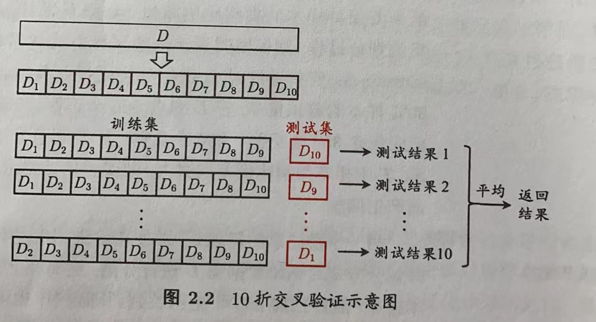
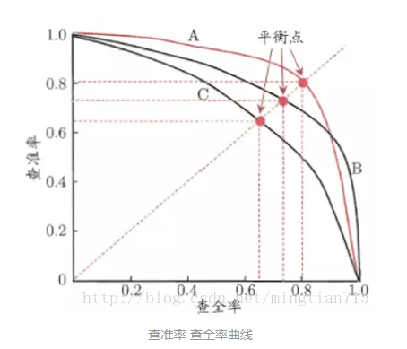
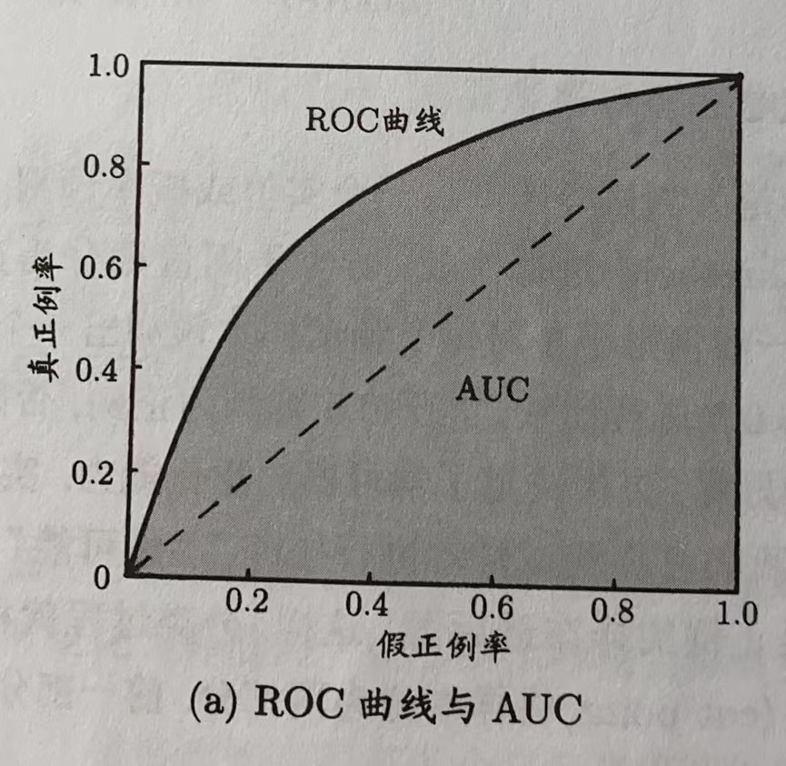
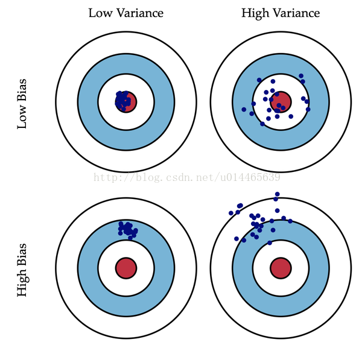
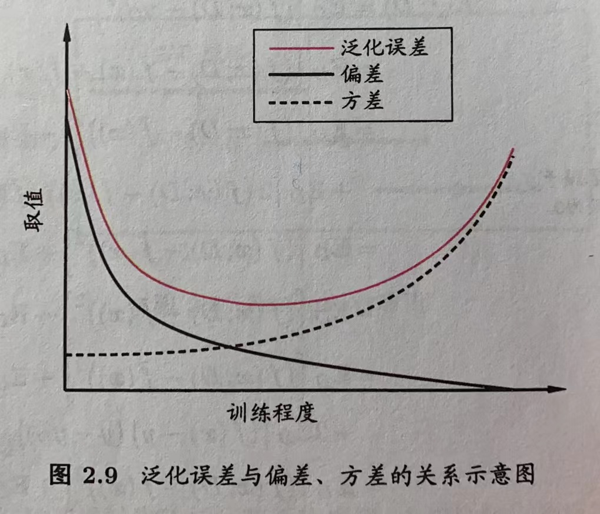

# 第2章 模型评估与选择

## 目录

-   [2.1过拟合](#21过拟合)
-   [2.2评估方法](#22评估方法)
-   [2.3性能度量](#23性能度量)
-   [2.4 偏差、方差](#24-偏差方差)

## 2.1过拟合

模型把训练样本自身的一些特点当作了所有潜在样本的一般性质，即模型在训练集上表现的很好，但是在测试集上表现一般，泛化性能较差，这就是过拟合。

解决方法：

1.  数据上，增加数据、清洗数据、数据增强等一些操作
2.  L1、L2正则化
    1.  L1正则化让权重向量在最优化的过程中变得稀疏，使得一些不重要的特征给予较小的权重或置为0，实现特征选择的功能；

        $Loss_{J(\theta)}=[y_{\theta}(x)-y]^2+[{\theta}_1^2+{\theta}_2^2+...]$
    2.  L2正则化对于大数值的权重向量进行严厉惩罚，倾向于更加分散的权重向量，使网络更倾向于使用所有输入特征，而不是严重依赖输入特征中某些小部分特征。

        $Loss_{J(\theta)}=[y_{\theta}(x)-y]^2+[|{\theta}_1|+|{\theta}_2|+...]$
3.  dropout，随机的丢掉一些神经元
4.  早停
5.  模型集成

## 2.2评估方法

1.  留出法，直接将数据集D划分为两个互斥的集合，分别为训练集和测试集。注意：数据集的划分要尽可能保持数据分布的一致性。在使用留出法时，一般采用若干次随机划分、重复进行实验评估后取平均值作为留出法的评估结果
2.  交叉验证

    
3.  自助法

    以自主采样法为基础，给定包含$m$个样本的数据集$D$，对它进行采样产生数据集$D'$，每次随机从$D$中挑选一个样本，将其拷贝放入$D'$，然后再将该样本放回初始数据集$D$中，使得该样本在下次采样时仍有可能被采样到；这个过程重复执行$m$次后，就得到了包含m个样本的数据集$D'$，这就是自助采样的结果。通过自助采样，初始数据集中约有$36.8\%$的样本未出现在采样数据集$D'$中。

    $lim_{m→∞}(1-\frac{1}{m})^m=\frac{1}{e}≈0.368$

**自助法**在**数据集较小**、**难以划分**有效训练/测试集时很有用；此外，自助法能从初始数据集产生多个不同的训练集，对**集成学习**等方法有很大好处。但是，自助法产生的数据集改变了初始数据集的分布，这会**引入估计偏差**。

初始**数据量足够**时，**留出法和交叉验证**法更常用。

## 2.3性能度量

-   回归任务

    最常用的性能度量是“均方误差(mean squared error，MSE)”：$E(f;D)=\frac{1}{m}\sum_{i=1}^m(f(\mathbf{x}_i)-y_i)^2$
-   分类任务
    -   错误率：分类错误的样本数占样本总数的比例
    -   精度：分类正确的样本数占样本总数的比例

        $acc(f;D)=\frac{1}{m}\sum_{i=1}^m(f(x_i)=y_i)=1-E(f;D)$&#x20;

        更一般的，对于数据分布$D$和概率密度函数$p(·)$，$acc(f;D)=\int_{x\sim D}(f(x)=y)p(x)dx=1-E(f;D)$
    -   查准率P、查全率R和F1

        对于二分类问题：
        | 分类结果混淆矩阵                                                   |           |           |
        | ---------------------------------------------------------- | --------- | --------- |
        | 真实情况                                                       | 预测结果      |           |
        |                                                            | 正例        | 反例        |
        | 正例                                                         | $TP$（真正例） | $FN$（假反例） |
        | 反例                                                         | $FP$（假正例） | $TN$（真反例） |
        | **查准率**（精确率$precision$）$P=\frac{TP}{TP+FP}$（预测为正例的预测真正例比例） |           |           |
        **查全率**（召回率$recall$）$R=\frac{TP}{TP+FN}$（预测为正例的样本数占所有实际为正例的样本数的比例）

        一般来说，查准率高时，查全率往往偏低；而查全率高时，查准率往往偏低

        

        P-R图直观地显示出学习器在样本总体上的查全率、查准率。如果一个学习器的P-R曲线被另一个学习器的曲线**完全包住**，可断言**后者的性能强于前者**；如果两个学习器的P-R曲线发生了交叉，难以一般性的断言两个学习器的好坏，只能通过具体的条件下进行比较，还有一个合理的判据时比较两条曲线下的面积大小。

        **F1度量：**$F1=\frac{2×P×R}{P+R}=\frac{2×TP}{样本总数+TP-TN}$

        F1度量的一般形式—$F_{\beta}$，能表达出对查准率\查全率的不同偏好：$F_{\beta}=\frac{(1+{\beta}^2)×P×R}{({\beta}^2×P)+R}$，$\beta=1为标准的F1$，$\beta>1$时查全率有更大影响，$\beta<1$时查准率有更大影响，
    -   ROC与AUC

        根据学习器的预测结果对样例进行排序，按此顺序逐个把样本作为正例进行预测，每次计算出两个重要量的值，分别以它们为横、纵坐标作图，得到“ROC曲线”。其中，纵轴是“真正例率（True Positive Rate，TPR）”，横轴是“假正例率（False Positive Rate，FPR）”，

        $TPR=\frac{TP}{TP+FN}$

        $FPR=\frac{FP}{TN+FP}$

        

        与P-R图类似，若一个学习器的ROC曲线被另一个学习器的曲线完全“包住”，则可断言后者的性能优于前者；若两个学习器的ROC曲线交叉，难以一般性的断言两个学习器的好坏，如果一定要比较，较为合理的判据是比较ROC曲线下面积，即AUC。

        AUC（Area Under the Curve）是ROC曲线下的面积，表示模型在所有可能阈值下的平均性能。AUC的取值范围在0到1之间，其中0.5表示随机预测，而1表示完美分类器。

## 2.4 偏差、方差

偏差：描述的是预测值（估计值）的期望与真实值之间的差距。对象是单个模型，期望输出与真实标记的差别（可以解释为描述了 模型对本训练集的拟合程度）。

方差：描述的是预测值的变化范围，离散程度，也就是离其期望值的距离。方差越大，数据的分布越分散。对象是多个模型（这里更好的解释是换同样规模的训练集，模型的拟合程度怎么样；也可以说方差是刻画数据扰动对模型的影响，描述的是训练结果的分散程度）。

以回归任务为例，$y_D$为测试样本$x$在数据集中的标记，$y$为$x$的真实标记，$f(x;D)$为训练集$D$上学的模型$f$在$x$上的预测输出，

学习算法的期望预测为：（期望计算公式$E(X)=\sum\limits_{i=1}^{n}X_iP_i$，其中P为随机变量X发生的概率）

$\bar{f}(x)=E_D[f(x;D)]$

样本数相同的不同训练集产生的方差为：

$var(x)=E_D[(f(x;D)-\bar{f}(x))^2]$

噪声为：

$\varepsilon^2=E_D[(y_D-y)^2]$

期望输出与真实标记的差别称为偏差(bias)：

$bias^2(x)=(\bar{f}(x)-y)^2$

算法的期望泛化误差：

$E(f;D)=bias^2(x)+var(x)+\varepsilon^2$

其中，偏差度量了学习算法的期望预测与真实结果的偏离程度，即学习算法本身的拟合能力；方差度量了同样大小的训练集的变动所导致的学习性能的变化，即刻画了数据扰动所造成的影响；噪声表达了当前任务上任何学习算法所能达到的期望泛化误差的下界，即刻画了学习问题本身的难度。

这里解释一下期望预测：期望预测是指在已知数据集的情况下，根据模型的参数和输入数据计算得到的结果。也就是说，我们**已经知道**了这个**数据集的特征和规律**，并且**也知道了模型的参数**。因此，我们可以将这些信息代入到模型中，然后计算出每个输入数据对应的输出结果的期望值。而训练得到的模型预测，是指使用训练数据集对模型进行训练，然后使用测试数据集对模型进行测试得到的结果。

对于学习任务，为取得好的泛化性能，则需使偏差较小，即能够充分拟合数据，并且使方差较小，即数据扰动产生的影响小。

一般来说，偏差方差是有冲突的。给定学习任务，假定我们能控制学习算法的训练程度，则在训练不足时，学习器的拟合能力不够强，训练数据的扰动不足以使学习器产生显著变化，此时偏差主导了泛化错误率；随着训练程度的加深，学习器的拟合能力逐渐增强，训练数据发生的扰动渐渐能被学习器学到，方差逐渐主导了泛化错误率；在训练程度充足后，学习器的拟合能力已非常强，训练数据发生的轻微扰动都会导致学习器发生显著变化，若训练数据自身的、非全局的特性被学习器学到，则将发生过拟合。

