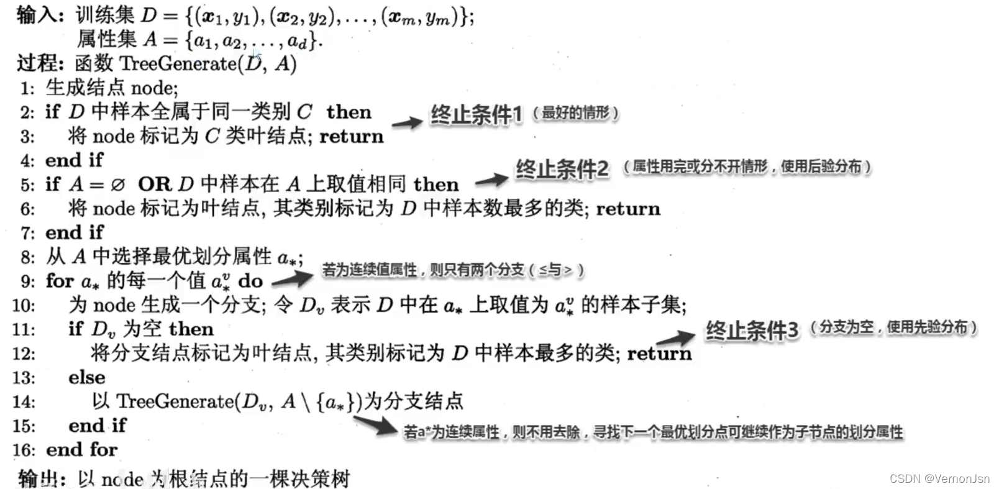

# 第4章 决策树

## 4.1基本流程

决策树是什么？决策树(decision tree)是一种基本的分类与回归方法。

具体来说，可以把决策树看成一个if-then规则的集合，将决策树转换成if-then规则的过程是这样的：由决策树的根结点(root node)到叶结点(leaf node)的每一条路径构建一条规则；路径上内部结点的特征对应着规则的条件，而叶结点的类对应着规则的结论。决策树的路径或其对应的if-then规则集合具有一个重要的性质：互斥并且完备。这就是说，每一个实例都被一条路径或一条规则所覆盖，而且只被一条路径或一条规则所覆盖。这里所覆盖是指实例的特征与路径上的特征一致或实例满足规则的条件。

## 4.2 划分选择

决策树学习的关键是第8行，即如何选择最优划分属性。一般而言，随着划分过程不断进行，我们希望决策树的**分支结点所包含的样本尽可能属于同一类别**，即**结点的“纯度”越来越高**。

-   信息增益 ID3

    “信息熵”是度量样本集合纯度最常用的一种指标。假设当前样本集合$D$中第$k$类样本所占的比例为$p_k(k=1,2,...,|y|)$，则D的信息熵为

    $Ent(D)=-\sum^{|y|}_{k=1}p_klog_2p_k$    (1)

    $Ent(D)$**的值越小，则D的纯度越高**。这个公式的基本思想是，每个事件发生的概率越大，其所携带的信息量就越小，因为我们对这种事件的发生不感到意外；相反，每个事件发生的概率越小，其所携带的信息量就越大，因为我们对其发生感到更加意外。所以，信息熵的定义确保了越不确定的事件熵越大。

    假定离散属性$a$有$V$个可能的取值$\{a^1,a^2,...,a^V\}$，若使用$a$来对样本集$D$进行划分，则会产生$V$个分支结点，其中第$v$个分支结点包含了$D$中所有在属性$a$上取值为$a^v$的样本，记为$D^v$。可以根据式1计算出$D^v$的信息熵，再考虑到不同的分支结点所包含的样本数不同，给分支结点赋予权重$|D^v|/|D|$，即样本数越多的分支结点的影响越大，于是可计算出属性$a$对样本集$D$进行划分所获得的“信息增益”：

    $Gain(D,a)=Ent(D)-\sum ^V_{v=1}\frac{|D^v|}{|D|}Ent(D^v)$  (2)

    一般而言，信息增益越大，则意味着使用属性$a$对样本集$D$ 进行划分所获得的“纯度提升”越大。
-   增益率

    实际上，**信息增益准则对可取数目较多的属性有所偏好**，为减少这种偏好可能带来的不利影响，C4.5决策树算法不直接使用信息增益，而是使用“增益率”来选择最优划分属性。增益率定义为：

    $Gain\_ratio(D,a)=\frac{Gain(D,a)}{IV(a)}$  (3)

    其中，

    $IV(a)=-\sum^V_{v=1}\frac{|D^v|}{|D|}log_2\frac{|D^v|}{|D|}$  (4)

    称为属性$a$的“固有值”。属性$a$的可能取值数目越多（即$V$越大），则$IV(a)$的值通常越大。

    增益率准则对可取值数目较少的属性有所偏好，因此C4.5算法并不是直接选择增益率最大的候选划分属性，而是使用了一个启发式：先从候选划分属性中找到信息增益高于平均水平的属性，再从中选择增益率最高的。
-   基尼指数

    CART决策树使用“基尼指数”来选择划分属性。数据集D的纯度可用基尼值来度量：

    $Gini(D)=\sum^{|y|}_{k=1}\sum_{k^{'}\neq k}p_kp_{k^{'}}=1-\sum^{|y|}_{k=1}p_k^2$  (5)

    直观来说，$Gini(D)$反映了从数据集D中随机抽取两个样本，其类别标记不一致的概率。因此，$Gini(D)$越小，则数据集D 的纯度越高。

    属性$a$的基尼指数定义为

    $Gini\_index(D,a)=\sum^V_{v=1}\frac{|D^v|}{|D|}Gini(D^v)$  (6)

    于是，在侯选属性集合A中，选择使得划分后基尼指数最小的属性作为最优划分属性。

## 4.3 剪枝处理

剪枝是决策树学习算法处理过拟合的主要手段。决策树学习过程中，为了尽可能正确分类训练样本，结点划分过程将不断重复，有时会造成决策树分支过多，就可能因训练样本学的“太好”了，导致过拟合。

**预剪枝**

在决策树生成过程中，对每个结点在划分前先进行估计，若当前结点的划分不能带来决策树泛化性能提升，则停止划分并将当前结点标记为叶节点。

预剪枝使决策树的很多分支都没有“展开”，这不仅降低了过拟合的风险，还显著减少了决策树的训练时间开销和测试时间开销。但另一方面，有些分支的当前划分虽不能提升泛化性能、甚至可能导致泛化性能暂时下降，但在其基础上进行的后续划分却有可能导致性能显著提高；预剪枝基于“贪心”本质禁止这些分支展开，带来了欠拟合的风险。

**后剪枝**

先从训练集生成一颗完整的决策树，然后自底向上地对非叶节点进行考察，若将该节点对应的子树替换为叶节点能带来决策树 泛化性能的提升，则将该子树替换为叶节点。

一般情况下，后剪枝决策树的欠拟合风险很小，泛化性能往往优于预剪枝决策树。但后剪枝过程是在生成完全决策树之后进行的，并且要自底向上地对树中的所有非叶子节点进行逐一考察，因此训练时间开销比未剪枝决策树和预剪枝决策树都要大很多。
