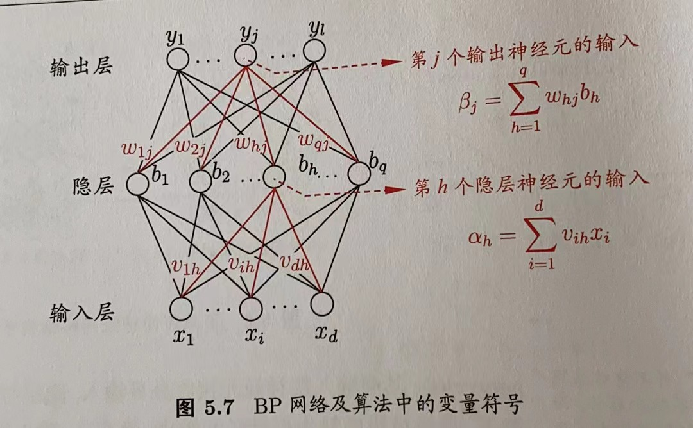

# 第5章 误差反向传播推导

## 目录

-   [5.1误差反向传播算法](#51误差反向传播算法)

## 5.1误差反向传播算法

以BP为例：

给定训练集$D=\{(x_1,y_1),(x_2,y_2),...,(x_m,y_m)\},x_i\in R^d,y_i\in R^l$，即输入示例由$d$个属性描述，输出$l$维实值向量。

图中输出层第$j$个神经元的阈值用$\theta_j$表示，隐层第$h$个神经元的阈值用$\gamma_h$表示，输入层第$i$个神经元与隐层第$h$个神经元之间的连接权为$v_{ih}$，隐层第$h$个神经元与输出层第$j$个神经元之间的连接权为$w_{hj}$。隐层第$h$个神经元接收到的输入为$\alpha_h=\sum_{i=1}^dv_{ih}x_i$，输出层第$j$个神经元接收到的输入为$\beta_j=\sum_{h=1}^qw_{hj}b_h$

假设神隐层和输出层神经元都使用sigmoid函数，对训练例$(x_k,y_k)$，假定神经网络的输出为$\hat{y}^k=(\hat{y}^k_1,\hat{y}^k_2,...,\hat{y}^k_l)$，即

$\hat{y}^k_j=f(\beta_j-\theta_j)$ （1）

则网络在$(x_k,y_k)$上的均方误差为

$ E_k=\frac{1}{2}\sum^l_{j=1}(\hat{y}^k_j-y^k_j)  $ （2）

BP是一个迭代学习算法，在迭代的每一轮中采用广义的感知机学习规则对参数进行更新估计，任意参数$v$的更新估计式为

$v\leftarrow v+\Delta v$  （3）

-   下面以隐层到输出层的连接权$w_{hj}$为例进行推导：

    BP算法基于梯度下降策略，以目标的负梯度方向对参数进行调整。给定学习率$\eta$，有

    $\Delta w_{hj}=-\eta \frac{\partial E_k}{\partial w_{hj}}$  （4）

    注意到$w_{hj}$先影响到第$j$个输出层神经元的输入值$\beta_j$，再影响到其输出值$\hat{y}^k_j$，然后影响到$E_k$，有

    $\frac{\partial E_k}{\partial w_{hj}}=\frac{\partial E_k}{\partial \hat{y}^k_j}·\frac{\partial \hat{y}^k_j}{\partial \beta_j}·\frac{\partial \beta_j}{\partial w_{hj}}$  (5)

    根据$\beta_j$的定义，显然有

    $\frac{\partial \beta_j}{\partial w_{hj}}=b_h$  (6)

    Sigmoid函数有一个很好的性质：$f^{'}(x)=f(x)(1-f(x))$

    于是由式1和2有

    $g_j=-\frac{\partial E_k}{\partial \hat{y}^k_j}·\frac{\partial \hat{y}^k_j}{\partial \beta_j}=-(\hat{y}^k_j-{y}^k_j)f^{'}(\beta_j-\theta_j)=\hat{y}^k_j(1-\hat{y}^k_j)({y}^k_j-\hat{y}^k_j)$   (7)

    将式6和7代入5，再代入4，就得到了BP算法中关于$w_{hj}$的更新公式

    $\Delta w_{hj}=\eta g_jb_h$    (8)

    类似可得

    $\Delta \theta_{j}=-\eta g_j$    (9)

    $\Delta v_{ih}=\eta e_hx_i$    (10)

    $\Delta \gamma_{h}=-\eta e_h$    (11)

    $e_h=-\frac{\partial E_k}{\partial b_h}·\frac{\partial b_h}{\partial \alpha_h}=-\sum^l_{j=1}\frac{\partial E_k}{\partial \beta_j}·\frac{\partial \beta_j}{\partial b_h}f^{'}(\alpha_h-\gamma_h)\\=\sum^l_{j=1}w_{hj}g_jf^{'}(\alpha_h-\gamma_h)\\=b_n(1-b_n)\sum^l_{j=1}w_{hj}g_j$   （12)

    BP算法的目标是最小化训练集D上的最小误差

    $E=\frac{1}{m}\sum^m_{k=1}E_k$  (13)
