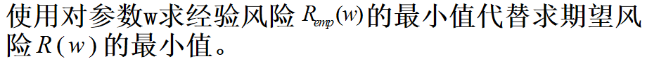
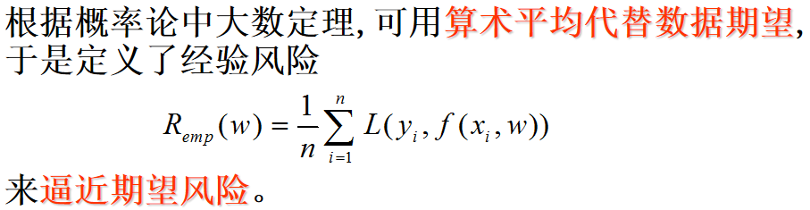
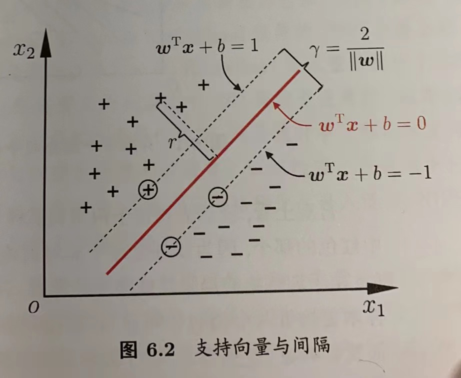
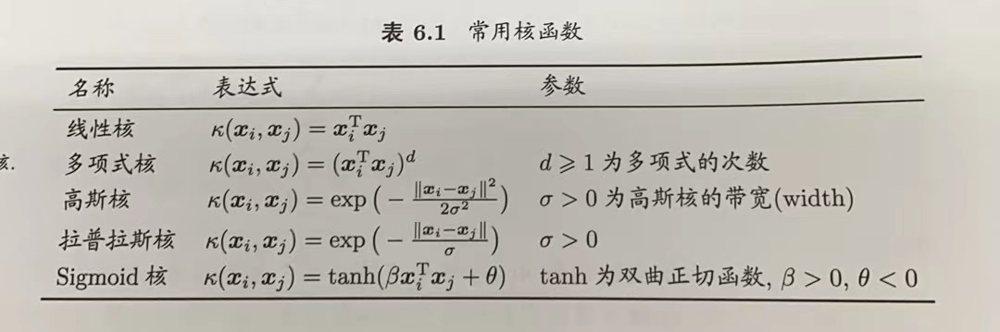

# 第6章 统计学习理论与支持向量机

-   统计学习理论
    -   目前针对有限样本统计估计和预测学习的最佳理论
    -   VC维（用来衡量函数集的性能）

        对于一个指示函数（即只有0和1两种取值的函数）集，如果存在$h$个样本能够被函数集里的函数按照所有可能的$2^h$种形式分开，则称函数集能够把$h$个样本打散，函数集的VC维就是能够打散的最大样本数目

        VC维越大, 学习能力就越强

        **VC维度可以代表假设集合的复杂程度**，这也是我们引出VC维度的初衷（我们试图解决$h(x)$集合太大给我们带来的坏资料的问题）。VC维度越大，一个假设集合大小的上限函数就会增加假设集合的复杂程度。**VC维度还可以代表假设本身的复杂性**
    -   经验风险最小化原则（ERM）

        

        

        从期望风险最小化到经验风险最小化没有可靠的依据,只是直观上合理的想当然。
        期望风险和经验风险都是w的函数,概率论中的大数定理只说明了当样本趋于无穷多时经验风险将在概率意义上趋近于期望风险,并没有保证两个风险的w是同一点,更不能保证经验风险能够趋近于期望风险。
    -   结构风险最小化（SRM）

        把函数集构造为一个函数子集序列，使各个子集按照VC维的大小排列；在每个子集中寻找最小经验风险，在子集间折衷考虑经验风险和置信范围，取得实际风险的最小。

## 6.1 SVM支持向量机基本型

SVM是一种基于结构风险最小化准则的学习方法，以训练误差作为优化问题的约束条件，以置信范围值最小化作为优化目标。

给定训练样本集$D=\{(x_1,y_1),(x_2,y_2),...,(x_m,y_m)\},y_i\in \{-1,+1\}$，

在样本空间中，划分超平面可通过如下线性方程来描述：

$w^Tx+b=0$  (1)

其中，$ w=(w_1,w_2,...,w_d)
  $为法向量，决定了超平面的方向；$b$为位移项，决定了超平面与原点之间的距离。显然，划分超平面可被法向量$w$和位移$b$确定，样本空间中任意点$x$到超平面$(w,b)$的距离可写为

$r=\frac{|w^Tx+b|}{||w||}$  (2)

假设超平面$(w,b)$能将训练样本正确分类，即对于$(x_i,y_i)\in D$，若$y_i=+1$，则有$w^Tx_i+b>0$；若$y_i=-1$，则有$w^Tx_i+b<0$，令：

$ \left \{ \begin{array}{cc} w^Tx_i+b\geq+1,y_i=+1;\\ w^Tx_i+b\leq-1,y_i=-1\end{array}\right .  $   (3)

如下图所示，

距离超平面最近的训练样本点使式3的等号成立，它们被称为“支持向量”，两个异类支持向量到超平面的距离之和为

$\gamma=\frac{2}{||w||}$  (4)

它被称为间隔。

欲找到具有“最大间隔”的划分超平面，也就是要找到能满足式3中约束的参数$w$和$b$，使得$\gamma$最大，即

$ \left \{ \begin{array}{cc} {\textstyle \max_{w,b}}\ \ \frac{2}{||w||}\\ {\textstyle s.t.}\ \ y_i(w^Tx_i+b)\geq1,\ i=1,2,...,m\end{array}\right .  $  (5)

显然，为了最大化间隔，仅需最大化$||w||^{-1}$，这等价于最小化$||w||^{2}$，于是式5可重写为

$ \left \{ \begin{array}{cc} {\textstyle \min_{w,b}}\ \ \frac{1}{2}||w||^2\\ {\textstyle s.t.}\ \ y_i(w^Tx_i+b)\geq1,\ i=1,2,...,m\end{array}\right .  $  (6)

这就是支持向量机（SVM）的基本型。

## 6.2对偶问题

式6的求解可以有更高效的方法，使用拉格朗日乘子法可得到其“对偶问题”，即将SVM问题转化为一个最小化的二次凸优化问题。对偶问题的优势在于，在最优解中，只有一部分拉格朗日乘子对应的样本点处于支持向量（距离分类边界最近的点），其他样本点的对应乘子为零，不参与最优解的计算。这样，对偶问题的求解可以转化为只涉及支持向量的计算，避免了对整个数据集的处理。

具体来说，对式6的每条约束添加拉格朗日乘子$\alpha_i\geq0$，则该问题的拉格朗日函数可写为

$L(w,b,\alpha)=\frac{1}{2}||w||^2+\sum^m_{i=1}\alpha_i(1-y_i(w^Tx_i+b))$   (8)

其中$\alpha=(\alpha_1;\alpha_2,...,\alpha_m)$。令$L(w,b,\alpha)$对$w$和$b$的偏导为0可得

$w=\sum_{i=1}^m\alpha_iy_ix_i$   (9)

$0=\sum_{i=1}^m\alpha_iy_i$   (10)

将式9带入式8，即可将$L(w,b,\alpha)$中的$w$和$b$消去，再考虑10的约束，就得到式6的对偶问题

$ \left \{ \begin{array}{cc} {\textstyle \max_{\alpha}}\ \ \sum_{i=1}^m\alpha_i-\frac{1}{2}\sum_{i=1}^m\sum_{j=1}^m\alpha_i\alpha_jy_iy_jx_i^Tx_j\\ {\textstyle s.t.}\ \ \alpha_iy_i=0,\\ \alpha_i\geq0,\ i=1,2,...,m\end{array}\right .  $  (11)

解出$\alpha$后，求出$w$和$b$即可得到模型

$f(x)=w^Tx+b=\sum_{i=1}^m\alpha_iy_ix_i^Tx_j+b$   (12)

注意到式6中的约束不等式，因此上述过程需要满足KKT条件，即

$ \left \{ \begin{array}{cc} \alpha_i\geq0,\\y_if(x_i)-1\geq0,\\ \alpha_i(y_if(x_i)-1)=0 \end{array}\right .  $  (13)

于是，对任意训练样本，$(x_i,y_i)$，总有$\alpha_i=0$或$y_if(x_i)=1$。若$\alpha_i=0$，则该样本将不会在式12的求和中出现，也就不会对$f(x)$有任何影响；若$\alpha_i\geq0$，则必有$y_if(x_i)=1$，所对应的样本点位于最大间隔边界上 ，是一个支持向量。这显示出支持向量机的一个重要性质：训练完成后，大部分的训练样本都不需保留，最终模型仅与支持向量有关。

## 6.3核函数

讨论支持向量机基本型的时，假设样本线性可分，**现实任务中，原始样本空间中可能并不存在一个能正确划分两类样本的超平面。对于这类问可以通过核函数方法解决。**

-   通过某种事先选择的非线性映射（核函数）将输入向量映射到一个高维特征空间，在这个空间中寻找最优分类超平面。使得它能够尽可能多的将两类数据点正确的分开，同时使分开的两类数据点距离分类面最远。
-   用不同的核函数k(x,xi)可以构造实现输入空间中不同类型的非线性决策面的学习机，从而导致不同的支持向量算法 。常用核函数：

    

令$\phi(x)$表示将$x$映射后的特征向量，于是在特征空间中划分超平面所对应的模型克表示为

$f(x)=w^T\phi(x)+b$  (19)

类似式6，有

$ \left \{ \begin{array}{cc} {\textstyle \max_{w,b}}\ \ \frac{1}{2}||w||^2\\ {\textstyle s.t.}\ \ y_i(w^T\phi(x_i)+b)\geq1,\ i=1,2,...,m\end{array}\right .  $   (20)

其对偶问题是

$ \left \{ \begin{array}{cc} {\textstyle \max_{\alpha}}\ \ \sum_{i=1}^m\alpha_i-\frac{1}{2}\sum_{i=1}^m\sum_{j=1}^m\alpha_i\alpha_jy_iy_j\phi(x_i)^T\phi(x_j)\\ {\textstyle s.t.}\ \ \alpha_iy_i=0,\\ \alpha_i\geq0,\ i=1,2,...,m\end{array}\right .  $  (21)

求解式21涉及到计算$\phi(x_i)^T\phi(x_j)$，这是$x_i$与$x_j$映射到特征空间后的内积。由于特征空间维度可能很高，直接计算$\phi(x_i)^T\phi(x_j)$通常是困难的，因此可以设计一个函数

$k(x_i,x_j)=\ <\phi(x_i),\phi(x_j)>\ =\phi(x_i)^T\phi(x_j)$   (22)

于是

$ \left \{ \begin{array}{cc} {\textstyle \max_{\alpha}}\ \ \sum_{i=1}^m\alpha_i-\frac{1}{2}\sum_{i=1}^m\sum_{j=1}^m\alpha_i\alpha_jy_iy_j\phi(x_i)^T\phi(x_j)\\ {\textstyle s.t.}\ \ \alpha_iy_i=0,\\ \alpha_i\geq0,\ i=1,2,...,m\end{array}\right .  $  (23)

求解后即可得到

$\left .\begin{array}{cc}f(x)=w^T\phi(x)+b\\=\sum_{i=1}^m\alpha_iy_i\phi(x_i)^T\phi(x)+b\\=\sum_{i=1}^m\alpha_iy_ik(x,x_i)+b\end{array}\right.$   (24)

这里的$k(·,·)$就是核函数。

-   优点：
    1.  可以使用核函数将**原始数据映射到高维的特征空间**上，进而**解决非线性的分类问题**；
    2.  SVM的分类思想很简单，就是将样本与分类面的间隔最大化
    3.  SVM的分类效果较好
-   缺点：
    1.  SVM无法直接支持多分类任务，但是可以通过间接的方法来实现多分类(这点跟逻辑回归的分类思想很像，间接的多分类方法有一对一、一对其余、多对多这三种拆分策略)
    2.  对某些缺失数据敏感,对**核函数的选择**也**很敏感**

## 6.4软间隔和正则化

前面讨论的支持向量机的形式式要求所有样本均满足约束，即**所有样本都必须划分正确**，这称为“硬间**隔**”。然而现实任务很难确定合适的核函数使得样本完全可分，于是引入“**软间隔**”的概念。

**软间隔则是允许某些样本不满足约束**

$y_if(x_i)\geq1$   （28）

于是优化目标可写为

$\min_{w,b}\frac{1}{2}||w||^2+C\sum_{i=1}^ml_{0/1}(y_i(w^Tx_i+b)-1)$   （29）

其中$C>0$是一个常数，$l$损失函数。显然，当$C$为无穷大时，式29迫使所有样本均满足约束，于是式29等价于式6；当$C$取有限值时，式29允许一些样本不满足约束。

三种常用的替代损失函数：

hinge损失：$l_{hinge}(z)=max(0,1-z)$   (31)

指数损失：$l_{exp}(z)=exp(-z)$   (32)

对率损失：$l_{log}(z)=log(1+exp(-z))$   (33)

引入 **“松弛变量”**$\xi_i\geq0$，可将式29重写为

$ \left \{ \begin{array}{cc} {\textstyle \min_{w,b,\xi_i}}\ \ \frac{1}{2}||w||^2+C\sum_{i=1}^m\xi_i
\\ {\textstyle s.t.}\ \ y_i(w^Tx_i+b)\geq1-\xi_i\\
\xi_i\geq0,\ \ i=1,2,...,m\end{array}\right .   $   （34）

这就是常用的“软间隔支持向量机”。

式29还可以写为更一般的形式

$\min_{f}\Omega(f)+C\sum_{i=1}^ml(f(x_i),y_i)$   （35）

其中$\Omega(f)$称为“结构风险”，用于描述模型$f$的某些性质；第二项$\sum_{i=1}^ml(f(x_i),y_i)$称为“经验风险”，用于描述模型与训练数据的契合程度；$C$用于对二者折中。从经验风险最小化的角度来看，$\Omega(f)$表述了我们希望获得具有何种性质的模型，这为引入领域知识和用户意图提供了途径；另一方面该信息有助于削减假设空间，从而降低了最小化训练误差的过拟合风险。从这个角度来看，式35称为“**正则化**”问题，$\Omega(f)$称为正则化项，$C$称为正则化常数。
