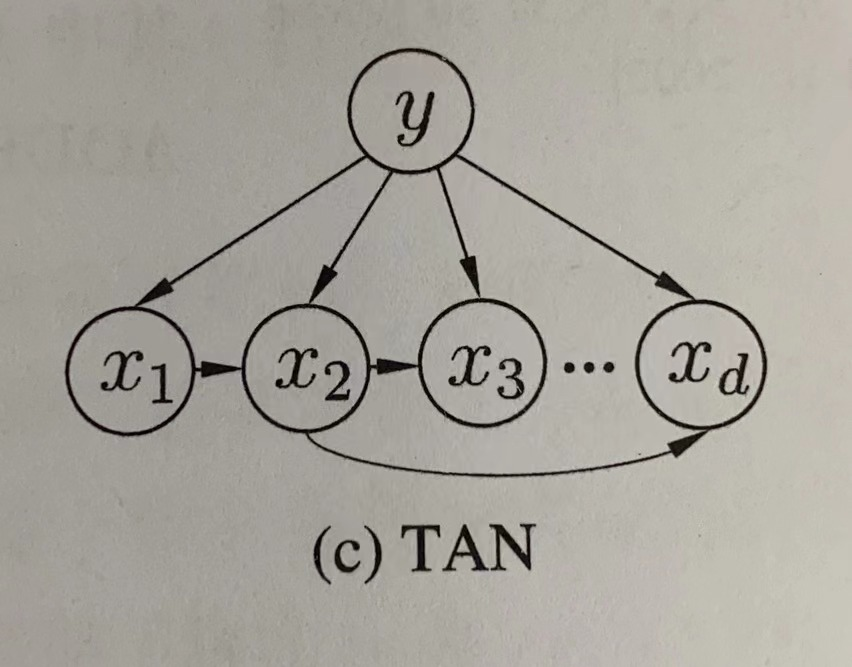
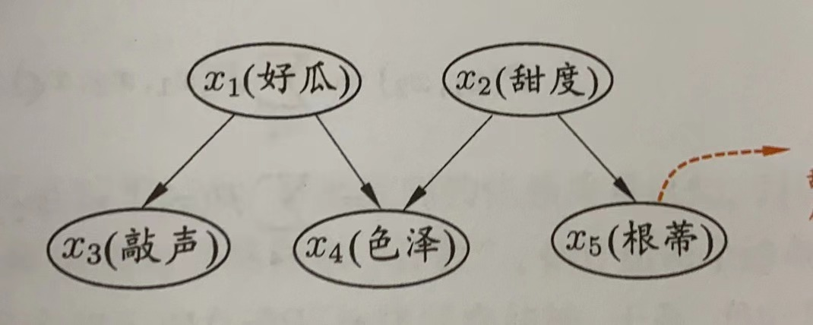
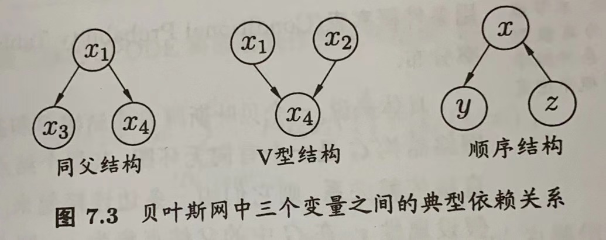

# 第7章 贝叶斯分类器

## 7.1 贝叶斯决策论

贝叶斯决策论是概率框架下实施决策的基本方法。对分类任务来说，在所有相关概率都已知的理想情形下，贝叶斯决策论考虑如何基于这些概率和误判损失来选择最优的类别标记。

假设有$N$种可能的类别标记，即$y=\{c_1,c_2,...c_N\}$，$ \lambda_{ij}  $是将一个真实标记为$c_j$的样本误分类为$c_i$所产生的损失。基于后验概率$P(c_i|x)$可获得将样本$x$分类为$c_i$所产生的期望损失，即在样本$x$上的“条件风险”

$R(c_i|x)=\sum_{j=1}^N\lambda_{ij}P(c_j|x)$   (1)

我们的任务是寻找一个判定准则$h:x\mapsto y$以最小化总体风险

$R(h)=E_x[R(h(x)|x)]$   (2)

显然，对每个样本$x$，若$h$能最小化条件风险$R(h(x)|x)$，则总体风险$R(h)$也将最小化。这就产生了贝叶斯判定准则：为最小化总体风险，只需在每个样本上选择那个能使条件风险$R(c|x)$最小的分类标记，即

$h^*(x)=argmin_{c\in y}R(c|x)$   (3)

此时，$h^*$称为贝叶斯最优分类器，与之对应的总体风险$R(h^*)$称为贝叶斯风险。$1-R(h^*)$反映了分类器所能达到的最好性能，即通过机器学习所能产生的模型精度的理论上限。

根据式3，若使用贝叶斯判定准则来最小化决策风险，首先要获得后验概率$P(c_i|x)$，然而，在现实任务这通常难以获得。从这个角度，机器学习所要实现的是基于有限的训练样本集尽可能准确地估计出后验概率$P(c_i|x)$。

主要有两种策略：给定$x$，可通过直接建模$P(c|x)$来预测$ c  $，这样得到的是“判别式模型”；也可先对联合概率分布$P(x,c)$建模，然后再由此获得$P(c|x)$，这样得到的是“生成式模型”。对于生成式模型，必然考虑

$P(c|x)=\frac{P(x,c)}{P(x)}$   (7)

基于贝叶斯定理，$P(c|x)$可写为

$   P(c|x)=\frac{P(c)P(x|c)}{P(x)} $   (8)

其中，$P(c)$是“先验概率”，$P(x|c)$是样本$x$相对于类标记$c$的“类条件概率”，或称为“似然”，$P(x)$是用于归一化的“证据”因子。对于给定样本$x$，证据因子$P(x)$与类标记无关，因此估计$P(c|x)$的问题就转化为如何基于训练数据$D$来估计先验$P(c)$和似然$P(x|c)$。

类先验概率$P(c)$表达了样本空间中各类样本所占的比例，根据大数定律，当训练集包含充足的独立同分布样本时，$P(c)$可通过各类样本出现的频率来进行估计。

对类条件概率$P(x|c)$来说，由于它涉及关于$x$所有属性的联合概率，直接根据样本出现的概率来估计将会遇到严重的困难。

## 7.2 极大似然估计

估计类条件概率的一种常用策略是先假定其具有某种确定的概率分布形式，再基于训练样本对概率分布的参数进行估计。具体的，记关于类别$c$的类条件概率为$P(x|c)$，假设$P(x|c)$具有确定的形式并且被参数向量$\theta_c$唯一确定，则我们的任务就是利用训练集$D$估计参数$\theta_c$。明确起见，将$P(x|c)$记为$P(x|\theta_c)$。

事实上，概率模型的训练过程就是参数估计过程。下面介绍极大似然估计方法，这是根据数据采样来估计概率分布参数的经典方法：
令$D_c$表示训练集$D$中第$c$类样本组成的集合，假设这些样本都是独立分布的，则参数$\theta_c$对于数据集$D_c$的似然是

$\begin{aligned}P(D_c|\theta_c)=\prod_{x\in D_c}P(x|\theta_c)\end{aligned}$   （9）

对$\theta_c$进行极大似然估计，就是去寻找能最大化似然估计$P(D_c|\theta_c)$的参数值$\hat{\theta}_c$。直观上看，极大似然估计是试图在$\theta_c$所有可能的取值中，找到一个能使数据出现的“可能性”最大的值。

式9中的连乘操作易造成下溢，通常使用对数似然

$\begin{aligned}LL(\theta_c)&=\log P(D_c|\theta_c)\\&=\sum_{x\in D_c}\log P(x|\theta_c)\end{aligned}$   (10)

此时参数$\theta_c$的极大似然估计$\hat{\theta}_c$为

$\hat{\theta}_c=argmax_{\theta_c}LL(\theta_c)$    (11)

例如在连续属性情形下，假设概率密度函数$p(x|c)\sim N(\mu_c,\sigma_c^2)$，则参数$\mu_c$和$\sigma_c^2$的极大似然估计为

$\begin{aligned}\hat{\mu}_c &= \frac{1}{|D_c|}\sum_{x\in D_c}\\ \sigma_c^2&=\frac{1}{|D_c|}\sum_{x\in D_c}(x-\hat{\mu}_c)(x-\hat{\mu}_c)^T\end{aligned}$

也就是说，通过极大似然法得到的是正态分布均值，也就是样本均值，方差就是$(x-\hat{\mu}_c)(x-\hat{\mu}_c)^T$的均值，这显然是一个符合直接的结果。

需要注意的是，这种参数化的方法虽然能使类条件概率估计变得相对简单，但估计结果的准确性严重依赖于所假设的概率分布形式是否符合潜在的真实数据分布。现实应用中，如果想做出能较好地接近潜在真实分布的假设，往往需要在一定程度上利用关于应用任务本身的经验知识。

## 7.3 朴素贝叶斯分类器

对类条件概率$P(x|c)$来说，由于它涉及关于$x$所有属性的联合概率，直接根据样本出现的概率来估计将会遇到严重的困难。为避开这个障碍，朴素贝叶斯分类器采用“**属性条件独立性假设**”：**对已知类别，假设所有属性相互独立**。于是，式8可重写为：

$   P(c|x)=\frac{P(c)P(x|c)}{P(x)}=\frac{P(c)}{P(x)}\prod_{i=1}^{d}P(x_i|c) $   (14)

其中，$d$为属性数目，$x_i$为$x$在第$i$个属性上的取值。

对于所有类别来说，$P(x)$相同，因此基于式3的贝叶斯判定准则有

$h_{nb}(x)=argmin_{c\in y}P(c)\prod_{i=1}^dP(x_i|c)$   (15)

这就是朴素贝叶斯分类器的表达式。

令$D_c$表示训练集D中第c类样本组成的集合，若有充足的独立分布样本，则可容易地估计出类先验概率

$P(c)=\frac{|D_c|}{|D|}$   (16)

对离散属性而言，令$D_{c,x_i}$表示$D_c$中在第$i$个属性上取值为$x_i$地样本组成的集合，则条件概率$P(x_i|c)$可估计为

$P(x_i|c)=\frac{|D_{c,x_i}|}{|D_c|}$   (17)

对连续属性可考虑概率密度函数，假定$p(x_i|c)\thicksim N(\mu_{c,i},\sigma_{c,i}^2)$，其中$\mu_{c,i}$和$\sigma_{c,i}^2$分别是第$c$样本在第$i$个属性上取值的均值和方差，则有

$p(x_i|c)=\frac{1}{\sqrt{2\pi}\sigma_{c,i}} exp(-\frac{(x_i-\mu_{c,i})^2}{2\sigma_{c,i}^2})$   (18)

为避免其他属性携带的信息被训练集中未出现的属性值“抹去”，在估计概率值时通常要进行“平滑”，常用**拉普拉斯修正**。令$N$表示训练集$D$中可能的类别数，$N_i$表示第$i$个属性可能的取值数，则式16和17分别修正为

$\hat{P}(c)=\frac{|D_c|+1}{|D|+N}$   (19)

$\hat{P}(x_i|c)=\frac{|D_{c,x_i}|+1}{|D_c|+N_i}$   (20)

## 7.4 半朴素贝叶斯分类器

朴素贝叶斯分类器采用了属性条件独立性假设，但在现实任务中这个假设往往很难成立。于是尝试对属性条件独立性假设进行一定程度的放松，即“半朴素贝叶斯分类器”。

半朴素贝叶斯分类器的基本想法是适当考虑一部分属性间的相互依赖信息，从而既不需进行完全联合概率运算，又不至于彻底忽略了比较强的属性依赖关系。“独依赖估计”是半朴素贝叶斯分类器最常用的一种策略，所谓“独依赖”就是假设每个属性在类别之外最多仅依赖于一个其他属性，即

$P(c|x)\propto P(c)\prod_{i=1}^{d}P(x_i|c,pa_i)$   (21)

其中$pa_i$为属性$x_i$所依赖的属性，称为$x_i$的父属性。此时，对每个属性$x_i$，若其父属性$pa_i$已知，则可采用类似式20的办法来估计概率值$P(x_i|c,pa_i)$，于是问题就转化为如何确定每个属性的父属性。

-   最直接做法是假设所有属性都依赖于同一个属性，称为“超父”，然后通过交叉验证等模型选择方法来确定超父属性，由此形成了**SPODE方法**。
-   TAN方法是在最大带权生成树算法的基础上，通过以下步骤将属性间的依赖关系约减为如下图所示的树形结构：

    
    1.  计算任意两个属性之间的条件互信息；

        $I(x_i,x_j|y)=\sum_{x_i,x_j;c\in y}P(x_i,x_j|c)log\frac{P(x_i,x_j|c)}{P(x_i|c)P(x_j|c)}$      (22)
    2.  以属性为结点构建完全图，任意两个结点之间边的权重设为$I(x_i,x_j|y)$；
    3.  构建此完全图的最大带权生成树，挑选根变量，将边置为有向；
    4.  加入类别结点$y$，增加从$y$到每个属性的有向边。
        条件互信息$I(x_i,x_j|y)$刻画了属性$x_i$和$x_j$在已知类别情况下的相关性。

## 7.5 贝叶斯网

贝叶斯网亦称“信念网”，**借助有向无环图来刻画属性之间的依赖关系**，并使用条件概率表来描述属性的联合概率分布。

具体来说，一个贝叶斯网$B$由结构$G$和参数$\Theta$两部分组成，即$B=<G,\Theta>$。网络结构$G$是一个有向无环图，其每个结点对应于一个属性，若两个属性有直接依赖关系，则它们由一条边连接起来；参数$\Theta$定量描述这种依赖关系，假设属性$x_i$在$G$中得到父节点集为$\pi_i$，则$\Theta$包含了每个属性的条件概率表$\theta_{x_i|\pi_i}=P_B(x_i|\pi_i)$。

**结构**：

贝叶斯网结构有效地表达了属性间的条件独立性。给定父结点集，贝叶斯网假设每个属性与它的非后裔属性独立，于是$B=<G，\Theta>$将属性$x_1,x_2,...,x_d$的联合概率分布定义为

$P_B(x_1,x_2,...,x_d)=\prod_{i=1}^dP_B(x_i|\pi_i)=\prod_{i=1}^d\theta_{x_i|\pi_i}$   (26)

以下图为例：

其联合概率分布为：

$P(x_1,x_2,x_3,x_4,x_5)=P(x_1)P(x_2)P(x_3|x_1)P(x_4|x_1,x_2)P(x_5|x_2)$

为了分析有向图中变量间的条件独立性，可使用“有向分离”。先把有向图转变为一个无向图：

-   找出有向图中的所有V型结构，在V型结构的两个父结点之间加上一条无向边；
-   将所有有向边改为无向边

由此产生的无向图称为“道德图”，令父结点相连的过程称为“道德化”。基于道德图能直观、迅速地找到变量间的条件独立性。假定道德图中有变量$x,y$和变量集合$z=\{z_i\}$，若变量$x$和$y$能在图上被$z$分开，即从道德图中将变量集合$z$去除后，$x$和$y$属于两个连通分支，则称变量$x$和$y$被$z$有向分离，$x\perp y|z$成立。

**学习**：

若网络结构已知，即属性间的依赖关系已知，则贝叶斯网的学习过程相对简单，只需通过对样本“计数”，估计出每个结点的条件概率表即可。但在现实应用中，我们往往不知晓网络结构，于是贝叶斯网学习的首要任务就是根据训练数据集来找出结构最“恰当”的贝叶斯网。“**评分搜索**”是求解这一问题的常用办法。

首先定义一个评分函数，以此来估计贝叶斯网与训练数据的契合程度，然后基于这个评分函数来寻找结构最优的贝叶斯网。显然，评分函数引入了关于我们希望获得什么样的贝叶斯网的归纳偏好。常用评分函数通常基于信息论准则，此类准则将学习问题看作一个数据压缩任务，学习的目标是找到一个能以最短编码长度描述训练数据的模型，此时编码的长度包括了描述模型自身所需的编码位数和使用该模型描述数据所需的编码位数。

对于贝叶斯网学习而言，模型就是一个贝叶斯网，同时，每个贝叶斯网描述了一个在训练数据上的概率分布，自有一套编码机制能使那些经常出现的样本有更短的编码。我们应选择那个综合编码长度 最短的贝叶斯网，这就是“最小描述长度”准则。

给定训练集$D=\{x_1,x_2,...,x_m\}$,贝叶斯网$B=<G,\Theta>$在$D$上的评分函数可写为

$s(B|D)=f(\theta)|B|-LL(B|D)$   (28)

其中，$|B|$是贝叶斯网的参数个数；$f(\theta)$表示描述每个参数$\theta$所需的编码位数；而

$LL(B|D)=\sum_{i=1}^mlogP_B(x_i)$   (29)&#x20;

是贝叶斯网$B$的对数似然。显然式28的第一项是计算编码贝叶斯网$B$所需的编码位数，第二项是计算$B$所对应的概率分布$P_B$对$D$描述得有多好。于是学习任务就转化为优化任务，即寻找一个贝叶斯网$B$使评分函数$s(B|D)$最小。

若贝叶斯网$B=<G,\Theta>$的网络结构$G$固定，则评分函数$s(B|D)$的第一项为常数，此时，最小化$s(B|D)$等价于对参数$\theta$的极大似然估计。由式29和26可知，参数$\theta_{x_i|\pi_i}$能直接在训练数据$D$上通过经验估计获得，即

$\theta_{x_i|\pi_i}=\hat{P}_D(x_i|\pi_i)$   (32)

其中$\hat{P}_D$是$D$上的经验分布。因此，为了最小化评分函数$s(B|D)$，只需对网络结构进行搜索，而候选结构的最优参数可直接在训练集上计算得到。

从所有可能的网络结构空间搜索最优贝叶斯网结构难以快速求解。有两种常用策略能在有限时间内求得近似解：第一种是贪心算法，例如从某个网络结构出发，每次调整一条边，直到评分函数值不再降低为止；第二种是通过给网络结构施加约束来削减搜索空间，例如将网络结构限定为树形结构等。

## 7.6 EM算法

前面的讨论，一直假设训练样本所有属性变量的值都已被观测到，即训练样本是“完整”的。但在现实生活中往往会遇到“不完整”的训练样本，在这种存在“未观测”变量的情形下，是否仍能对模型参数进行估计呢？

未观测变量的学名是“隐变量”，令$X$表示已观测变量集，$Z$表示隐变量集，$\Theta$表示模型参数。若对$\Theta$做极大似然估计，则应最大化对数似然

$LL(\Theta|X,Z)=lnP(X,Z|\Theta)$   (34)

$Z$是隐变量，无法直接求解，因此可以通过对$Z$计算期望，来最大化已观测数据的对数“边际似然”

$LL(\Theta|X)=lnP(X|\Theta)=ln\sum_ZP(X,Z|\Theta)$   (35)

EM算法是常用的**估计参数隐变量**的利器，这是一种**迭代式**的方法，**基本思想是：若参数**$\Theta$**已知，则可根据训练数据推断出最优隐变量**$Z$**的值（**$E$**步）；反之，若**$Z$**的值已知，则可方便地对参数**$\Theta$**做极大似然估计（M步）。**

于是，以初始值$\Theta^0$为起点，对式35，可迭代执行以下步骤直至收敛：

-   基于$\Theta^t$推断隐变量$Z$的期望，记为$Z^t$;
-   基于已观测变量$X$和$Z^t$对参数$\Theta$做极大似然估计，记为$\Theta^{t+1}$；

这就是EM算法的原型。

进一步，若不是取$Z$的期望，而是基于$\Theta^t$计算隐变量$Z$的概率分布$P(Z|X,\Theta^t)$，则EM算法的步骤如下：

-   E步：以当前参数$\Theta^t$推断隐变量分布$P(Z|X,\Theta^t)$，并计算对数似然$LL(\Theta|X,Z)$关于$Z$的期望

    $Q(\Theta|\Theta^t)=E_{Z|X,\Theta^t}LL(\Theta|X,Z)$   (36)
-   M步：寻找参数最大化期望似然，即：

    $\Theta^{t+1}=argmax_{\Theta}Q(\Theta|\Theta^t)$   (37)

简要来说，EM算法使用两个步骤交替计算：第一步是期望(E)步，利用当前估计的参数值来计算对数似然的期望值；第二步是最大化(M)步，寻找能使E步产生的似然期望最大化的参数值。然后新得到的参数值重新被用于E步，……，直至收敛到局部最优解。
