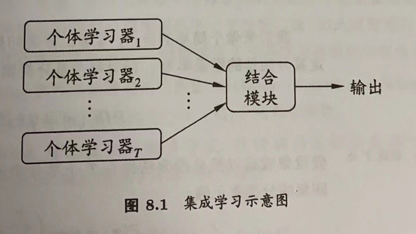
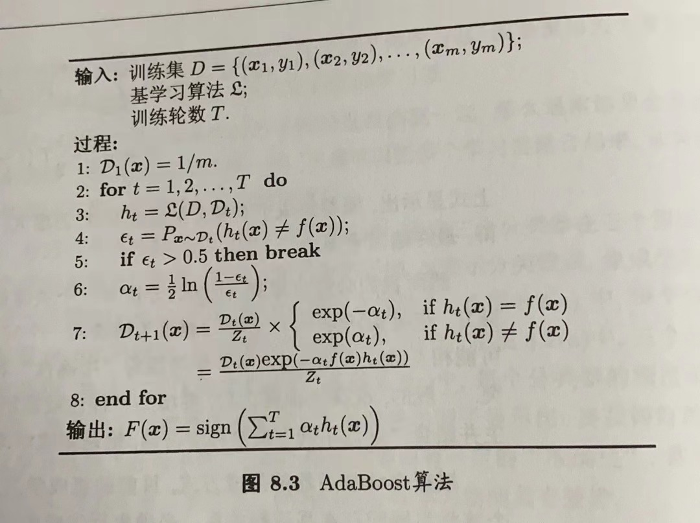
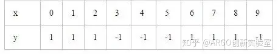
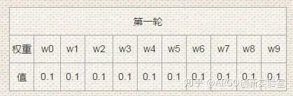
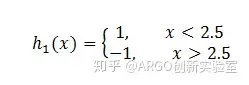
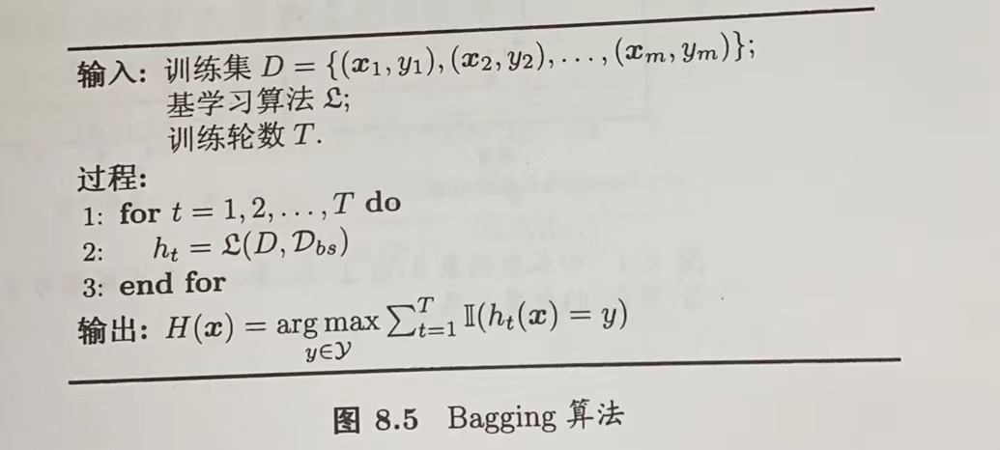
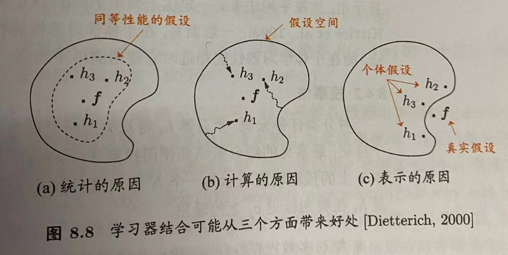
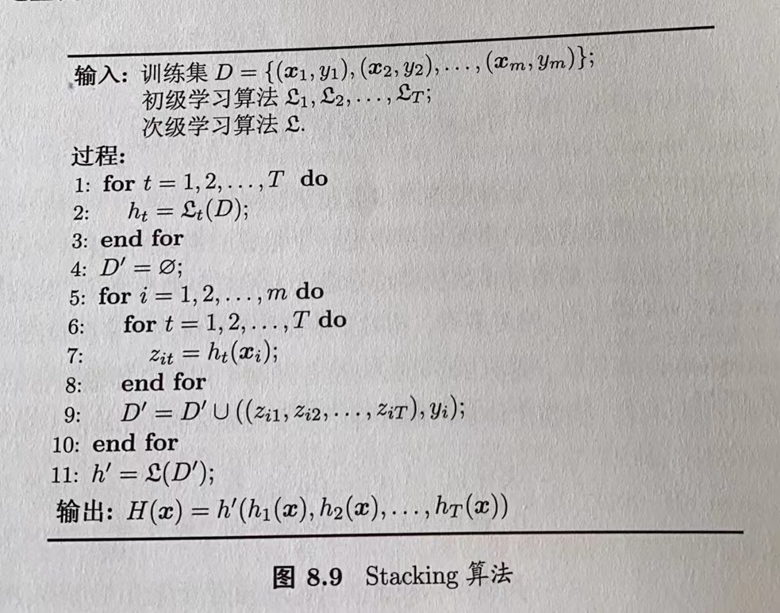

# 第8章 集成学习

## 目录

-   [8.1 个体与集成](#81-个体与集成)
-   [8.2 Boosting](#82-Boosting)
-   [8.3 Bagging和随机森林](#83-Bagging和随机森林)
-   [8.4 结合策略](#84-结合策略)
-   [8.5 多样性](#85-多样性)

## 8.1 个体与集成

集成学习（ensemble learning）通过构建并结合多个学习器来完成学习任务。

集成学习的一般结构：先产生一组“个体学习器”，再用某种策略将他们结合起来。个体学习器通常由一个现有的学习算法从训练数据产生，此时集成中只包含同种类型的个体学习器，例如“决策树集成”中全是决策树，这样的集成是“同质”的。同质集成中的个体学习器亦称“基学习器”，相应的学习算法称为“基学习算法”。集成也可包含不同类型的个体学习器，例如同时包含决策树和神经网络，这样的集成是“异质”的。异质集成中的个体学习器由不同的学习算法生成，这时就不再有基学习算法，个体学习器通常称为“组件学习器”或直接称为个体学习器。

集成学习通过将多个学习器进行结合，常可获得比单一学习器显著优越的泛化性能，这对“弱学习器”尤为明显。如何产生并结合“好而不同”的个体学习器是集成学习研究的核心。目前的集成学习方法大致可分为两类：1）个体学习器间存在**强依赖关系、必须串行生成**的**序列化**方法，代表算法是Boosting；2）个体学习器间**不存在强依赖关系**，**可同时生成**的并行化方法，代表算法是Bagging和随机森林Random Forest

## 8.2 Boosting

Boosting是一族可将弱学习器提升为强学习器的算法。这种算法的工作机制：**先从初始训练集训练出一个基学习器**，**再根据基学习器的表现**对**训练样本分布进行调整**，使得先前基学习器**做错的训练样本在后续受到更多关注**，然后**基于调整后的样本分布来训练下一个基学习器**；如此**重复**进行，直至基学习器数目达到事先指定的值$T$，最终**将这**$T$**个基学习器进行加权结合**。

Boosting算法最著名的代表是AdaBoost，算法流程如下：

1.  确定样本集;
2.  初始化样本数据的权重，如每个样本的权重为1/m;
3.  进行1，2，...，T轮迭代;

    a. 归一化样本权重

    b. 对样本集进行训练，并计算训练误差

    c. 选择误差最小的分类器作为本轮的分类器

    d. 根据预测结果更新样本数据的权重：预测错误样本增加权重，预测正确样本降低权重
4.  根据分类器的预测结果及其权重加权表决最终结果

-   实例

    假设训练样本如下，我们需要使用该样本对AdaBoost算法模型进行训练，训练轮数为3轮。x是特征值，y是标签

    
    -   第一轮

        对训练数据设定为相等的权重。为保证所有的权重值之和为1，初始权值一般设为1/n，如下图所示，$w_n$代表对应x变量的权重

        

        **i)** **训练弱分类器**：

        使用这个数据训练得到第一个弱分类器模型：深度为1的决策树（简单的分段函数），这个模型用数学公式表示为：

        

        **ii)** **计算弱分类器决策权重**

        用这个模型对该第一轮训练集的数据分类，得到的结果是\[ 1,1,1,-1, -1,-1,-1,-1,-1,-1]，能够发现x为6,7,8的数据结果分类错误，计算得到其错误率为： &#x20;

        

        计算 $ℎ_1(x)$，此弱分类器的决策权重：

        

        因此，可以得到第一轮的预测函数模型如下（参与决策时，我们将$F$预测结果值取$sign$）：

        

        按照$sign(F_1(x))$分类，训练集存在3个分类错误。

        **iii)** **更新样本权重**

        根据公式

        

        计算接下来第二轮的样本权重，其中$Z$为权重的**归一化因子**。这个公式虽然看上去复杂，但是指数部分$-y_i\alpha_ih_i(x_i)$中， $-y_ih_i(x_i)$当预测相同时为-1，预测相反时结果为1。 所以，**预测正确的样本的权重将下降，预测错误的样本权重将上升**。通过上述公式计算得到第二轮的权重值如下表，红色表示分错样本的权重：

        
    -   第二轮

        **i)** **训练弱分类器**：

        用第一轮的样本权重训练弱分类器$h_2(x)$，得：

        

        **ii)** **计算弱分类器决策权重：**

        $h_2(x)$的预测结果为\[1,1,1,1,1,1,1,1,-1,-1]，发现x为3,4,5的数据分类错误。基于上轮样本权重，计算误差率：

        

        计算该弱分类器的决策权重：

        

        由此，更新第二轮的预测函数：

        

        按照$sign(F_2(x))$分类，依然有3个分类错误。

        **iii)** **更新样本权重：**

        根据初始轮提供的样本权重更新公式，计算得到第三轮的样本权重

        
    -   第三轮（末轮）

        **i) 训练弱分类器**：

        用第二轮的权重样本训练得：

        

        **ii)** **计算弱分类器决策权重：**

        依据此分类器的分类结果\[-1,-1,-1,-1,-1,-1,1,1,1,1]，发现0,1,2,9分类错误，计算错误率和弱分类器决策权重：

        

        

        此时，最终的预测函数如下：

        

        按 $sign(F_3(x))$ 分类，没有出现分类错误，训练终止。得到最终的训练模型：

        
        注：AdaBoost 通常迭代多次直至得到最终的强分类器。迭代范围可以自己定义，如限定收敛阈值，分类误差率小于某一个值就停止迭代；如限定迭代次数，迭代1000次停止。本例中数据简单，在第三轮迭代时，得到强分类器的分类误差率为0，结束迭代。

Boosting算法要求基学习器能对特定的数据分布进行学习，这可通过“重赋权法”实施，即在训练过程的每一轮中，根据样本分布为每个训练样本重新赋予一个权重。在无法接受带权样本的基学习算法，则可通过“重采样法”来处理，在每一轮学习中，根据样本分布对训练集重新采样，再用重采样得到的样本集对基学习器进行训练。

需要注意的是，Boosting算法在训练的每一轮都要检查当前生成的基学习器是否满足基本条件，一旦条件不满足，则当前基学习器即被抛弃，且学习过程停止。此时，初始设置的学习轮数T可能远未达到，可能导致最终集成中只包含很少的基学习器而性能不佳。若采用“重采样法”，则可获得“重启动”机会以避免训练过程早停，即在抛弃不满足条件的当前基学习器后，可根据当前分布重新对训练样本采样，再基于新的采样结果重新训练出学习器，从而使得学习过程可以持续到预设的T轮完成。

从偏差-方差分解的角度看，Boosting主要关注降低偏差，因此Boosting能基于泛化性能相当弱的学习器构建出很强的集成。

## 8.3 Bagging和随机森林

欲得到泛化性强的集成，集成中的个体学习器应尽可能相互独立，虽然独立在现实任务中无法做到，但可以设法使基学习器尽可能具有较大差异。给定一个训练数据集，一种可能的做法是**对训练样本进行采样**，**产生出若干不同的子集**，再从每个数据子集中训练出一个基学习器，这样由于训练数据不同，获得的基学习器可望具有较大的差异。然而为了获得好的集成，我们同时希望个体学习器不能太差，如果采样出的每个子集都完全不同，则每个基学习器只用到了一小部分训练数据，甚至不足以进行有效的学习，这显然无法确保产生出比较好的基学习器。可以考虑看使用**相互有交叠的采样子集**来解决这个问题。

-   Bagging

    Bagging是并行式集成学习方法最著名的代表。该算法基于**自主采样法**。给定包含m个样本的数据集，先随机取出一个样本放入采样集中，再把该样本放回初始数据集，使得下次采样时该样本仍有可能被选中，这样经过m次随机采样操作，得到含m个样本的采样集，初始训练集中有的样本在采样集中多次出现，有的则从未出现。初始数据集中约有63.2%的样本出现在采样集中。

    Bagging 的基本流程如下：**基于自主采样法**，可采样出$T$个含$m$个训练样本的采样集，然后基于**每个采样集训练出一个基学习器**，再将这些基学习器进行结合。在**对预测输出进行结合**时，通常对分类任务**使用简单投票法**，对回归任务使用简单平均法。若分类预测时出现两个类收到同样票数的情形，最简单的做法是随机选择一个，也可进一步考察学习器投票的置信度来确定。

    

    与标准AdaBoost只使用于二分类任务不同，Bagging能不经修改地适用于多分类、回归任务。

    另外，自主采样过程还有另外一个优点：由于每个基学习器只使用了初始数据集中约63.2%的样本，剩下约36.8%的样本可用作验证集来对泛化性能进行“包外估计”。包外估计还有很多其他用途：例如当基学习器是决策树时，可以用包外样本来辅助剪枝等，当基学习器是神经网络时候，可用包外样本来辅助早停来减小过拟合风险。

    从偏差-方差分解的角度看，Bagging主要关注降低方差，因此在不剪枝决策树、神经网络等易受样本扰动的学习器上效用更为明显。
-   随机森林

    &#x20;随机森林是Bagging的一个扩展变体，RF在以决策树为基学习器构建Bagging集成的基础上，进一步在**决策树的训练过程中引入了随机属性选择**。具体来说，传统决策树在选择划分属性时是在当前结点的属性集合（假定有$d$个属性）中选择一个最优属性；而在RF中，对基决策树的每个结点，先从该结点的属性集合中随机选择一个包含k个属性的子集，然后再从这个子集中选择一个最优属性用于划分。这里的参数k控制了随机性的引入程度：若令$k=d$，则基决策树的构建与传统决策树相同；若令$k=1$，则是随机选择一个属性用于划分；一般情况下，推荐$k=\log_2d$。

    与Bagging中基学习器的“多样性”仅通过样本扰动而来不同，随机森林中基学习器的**多样性不仅来自样本扰动，还来自属性扰动**，这就使得最终集成的**泛化性能**可通过个体学习器之间差异度的增加进一步提升。

## 8.4 结合策略

学习器结合带来的好处：

1.  从统计的方面来看，由于学习任务的假设空间往往很大，可能有多个假设在训练集上达到同等性能，此时若使用但学习器可能因误选而导致泛化性能不佳，结合多个学习器能减小这一风险；
2.  从计算的方面来看，学习算法往往会陷入局部极小，有的局部极小点所对应的泛化性能可能很糟糕，通过多次运行后进行结合，可降低陷入糟糕局部极小点的风险；
3.  从表示的方面来看，某些学习任务的真实假设可能不在当前学习算法所考虑的假设空间中，此时若使用单学习器肯定无效，而通过结合多个学习器，由于相应的假设空间有所扩大，有可能学得更好的近似。

-   平均法

    对数值型输出$h_i(x)$，最常见的结合策略是使用平均法

    简单平均法：$H(x)=\frac{1}{T}\sum_{i=1}^Th_{i}(x)$

    加权平均法：$H(x)=\sum_{i=1}^Tw_ih_{i}(x)$，其中$w_i$是个体学习器$h_i$的权重，通常要求$w_i≥0,\sum_{i=1}^Tw_i=1$

    加权平均法的权重一般是从训练数据中学习而得，现实任务中的训练样本通常不充分或存在噪声，这将使得学出的权重不完全可靠。尤其是对规模较大的集成来说，要学习的权重比较多，较容易导致过拟合。因此实验和应用均表明，加权平均不一定由于简单平均。一般来说，在**个体学习器性能相差较大时宜使用加权平均法**，而在**个体学习器性能相近时宜使用简单平均法**。
-   投票法

    绝对多数投票法：即若某标记得票过半数，则预测为该标记；否则拒绝预测

    相对多数投票法：即预测为得票最多的标记，若同时有多个标记获得最高票，从中随机选择一个

    加权投票法：$H(x)=c_{argmax_j}\sum_{i=1}^Tw_ih_i^j(x)$，$w_i$时$h_i$的权重

    现实任务中，不同类型个体学习器可能产生不同类型的$h_i^j(x)$值，常见的有：

    类标记：$ h_i^j(x)\in \{0,1\}  $，亦称“硬投票”；

    类概率：$h_i^j(x)\in [0,1]$，相当于对后验概率$P(c_j|x)$的一个估计，亦称“软投票”
-   学习法

    当训练数据很多时，一种更为强大的结合策略是使用“学习法”，即通过另一个学习器来结合，也称次学习器或元学习器。

    典型算法有Stacking方法，Stacking先从初始数据集训练出初级学习器，然后“生成”一个新数据集用于训练次级学习器。在这个新数据集中，初级学习器的输出被当作样例输入特征，而初始样本的标记仍被当作样例标记。

    

## 8.5 多样性

-   误差-分歧分解(只适用于**回归学习**)

    欲构建泛化能力强的集成，个体学习器应“好而不同”。

    假定用个体学习器$h_1,h_2,...,h_T$通过加权平均法结合产生的集成来完成回归学习任务$f:R^d→R$。对示例$x$，定义学习器$h_i$的“分歧”为

    $A(h_i|x)=(h_i(x)-H(x))^2$   (27)

    则集成的“分歧”为

    $\bar{A}(h|x)=\sum_{i=1}^Tw_iA(h_i|x)=\sum_{i=1}^Tw_i(h_i(x)-H(x))^2$    (28)

    这里的 \*\*“分歧”项**表征了**个体学习器在样本\*\*$x$**上的不一致性**，即在一定程度上反应了**个体学习器的多样性**。

    个体学习器$h_i$和集成$H$的平方误差分别为

    $E(h_i|x)=(f(x)-h_i(x))^2$    (29)

    $E(H|x)=(f(x)-H(x))^2$    (30)

    令$\bar{E}(h|x)=\sum_{i=1}^Tw_i·E(h_i|x)$表示个体学习器误差的加权均值，有

    $\bar{A}(h|x)=\sum_{i=1}^Tw_iE(h_i|x)-E(H|X)=\bar{E}(h|x)-E(H|x)$    (31)

    式31对所有样本$x$均成立，令$p(x)$表示样本的概率密度，则在全样本上有

    $\sum_{i=1}^Tw_i\int A(h_i|x)p(x)dx=\sum_{i=1}^Tw_i\int E(h_i|x)p(x)dx-\int E(H|x)p(x)dx$  (32)

    类似的，个体学习器$h_i$在全样本上的泛化误差和分歧项分别为：

    $E_i=\int E(h_i|x)p(x)dx$   (33)

    $A_i=\int A(h_i|x)p(x)dx$   (34)

    集成的泛化误差为

    $E=\int E(H|x)p(x)dx$   (35)

    将式33-35带入32，令$\bar{E}=\sum_{i=1}^Tw_iE_i$表示个体学习器泛化误差的加权均值，$\bar{A}=\sum_{i=1}^Tw_iA_i$表示个体学习器的加权分歧值，有

    $E=\bar{E}-\bar{A}$   (36)

    式36可得出，个体学习器准确性越高、多样性越大，则集成越好，这个分析成为“误差-分歧分解”。
-   多样性度量

    多样性度量是用于度量集成中**个体分类器**的多样性，即估算个体学习器的多样化程度。典型做法是考虑个体分类器的两两相似/不相似性。

    给定数据集$D=\{(x_1,y_1),(x_2,y_2),...,(x_m,y_m)\}$，对二分类任务，$y_i\in \{-1,+1\}$，分类器$h_i$和$h_j$的预测结果列联表为
    |                                                           | $h_i=+1$ | $h_i=-1$ |
    | --------------------------------------------------------- | -------- | -------- |
    | $h_j=+1$                                                  | $a$      | $c$      |
    | $h_j=-1$                                                  | $b$      | $d$      |
    | 其中，$a$表示$h_i$与$h_j$均预测为正类的样本数目；$b、c、d$含义以此类推；$a+b+c+d=m$. |          |          |
    -   不合度量

        $dis_{ij}=\frac{b+c}{m}$，值域为$[0,1]$

        值越大则多样性越大
    -   相关系数

        $\rho_{ij}=\frac{ad-bc}{\sqrt{(a+b)(a+c)(c+d)(b+d)}}$，值域为$[-1,1]$

        若$h_i$与$h_j$无关，则值为0；若$h_i$与$h_j$正相关则值为正，否则为负
    -   $Q$-统计量

        $Q_{ij}=\frac{ad-bc}{ad+bc}$
    -   $k$-统计量

        $k=\frac{p_1-p_2}{1-p_2}$

        其中，$p_1$是两个分类器取得一致的概率；$p_2$是两个分类器偶然达成一致的概率

        其中，$p_1=\frac{a+d}{m}$，$p_2=\frac{(a+b)(a+c)+(c+d)(b+d)}{m^2}$。

        若分类器$h_i$与$h_j$在$D$上完全一致，则$k=1$；若偶然达成一致，则$k=0$。
-   多样性增强
    -   数据样本扰动。例如，在Bagging中使用自助采样法，在AdaBoost中使用序列采样法
    -   输入属性扰动。例如随机子空间算法。
    -   输出表示扰动。
    -   算法参数扰动。
