# 第9章 聚类

## 目录

-   [9.1 性能度量](#91-性能度量)
-   [9.2 距离计算](#92-距离计算)
-   [9.3 原型聚类](#93-原型聚类)
-   [9.4 密度聚类](#94-密度聚类)
-   [9.5 层次聚类](#95-层次聚类)

聚类试图将数据集中的样本划分为若干个通常是**不相交**的子集，每个子集称为一个“簇”。通过这样的划分，每个簇可能对应于一些潜在的概念(类别)，但这些概念对聚类算法而言事先是未知的，聚类过程仅能自动形成簇结构，簇所对应的概念语义需由使用者来把握命名。

## 9.1 性能度量

聚类性能度量亦称聚类“有效性指标”。评价聚类的好坏，即同一簇的样本尽可能彼此相似，不同簇的样本尽可能不同。聚类结果的“簇内相似度”高且“簇间相似度”低。

聚类性能度量大致有两类，一类是将聚类结果与某个“参考模型”进行比较，称为“外部指标”；另一类是直接考察聚类结果而不利用任何参考模型，称为“内部指标”。

对数据集$D=\{x_1,x_2,...,x_m\}$，假定通过聚类给出的簇划分为$C=\{C_1,C_2,...,C_k\}$，参考模型给出的簇划分为$C^*=\{C_1^*,C_2^*,...,C_k^*\}$。相应地，令$\lambda$与$\lambda^*$分别表示与$C$和$C^*$对应的簇标记向量。将样本两两配对考虑，定义

$a=|SS|,SS=\{(x_i,x_j)|\lambda_i=\lambda_j,\lambda_i^*=\lambda_j^*,i<j\}$    (1)

$b=|SD|,SD=\{(x_i,x_j)|\lambda_i=\lambda_j,\lambda_i^*\neq\lambda_j^*,i<j\}$   (2)

$c=|DS|,DS=\{(x_i,x_j)|\lambda_i\neq\lambda_j,\lambda_i^*=\lambda_j^*,i<j\}$   (3)

$d=|DD|,SS=\{(x_i,x_j)|\lambda_i\neq\lambda_j,\lambda_i^*\neq\lambda_j^*,i<j\}$   (4)

其中集合SS包含了在$C$中隶属于相同簇且在$C^*$中也隶属于相同簇的样本对，集合SD包含了在$C$中隶属于相同簇但在$C^*$中也隶属于不同簇的样本对，……由于每个样本对仅能出现在一个集合中，因此有$a+b+c+d=m(m-1)/2$成立。

基于式1-4可导出下面常用的聚类性能度量外部指标：

-   Jaccard系数：

    $JC=\frac{a}{a+b+c}$   (5)
-   FM指数：

    $FMI=\sqrt{\frac{a}{a+b}·\frac{a}{a+c}}$   (6)
-   Rand指数：

    $RI=\frac{2(a+d)}{m(m-1)}$   (7)

上述性能度量的结果值均在$[0,1]$区间，值越大越好。

考虑聚类结果的簇划分$C=\{C_1,C_2,...,C_k\}$，定义

$avg(C)=\frac{2}{|C|(|C|-1)}\sum_{1≤i<j≤|C|}dist(x_i,x_j)$   (8)

$diam(C)=max_{1≤i<j≤|C|}dist(x_i,x_j)$   (9)

$d_{min}(C_i,C_j)=min_{x_i\in C_i,x_j\in C_j} dist(x_i,x_j)$   (10)

$d_{cen}(C_i,C_j)=dist(\mu_i,\mu_j)$   (11)

$dist()$用于计算两个样本之间的距离；$\mu$代表簇$C$的中心点$\mu=\frac{1}{|C|}\sum_{1\leq i\leq |C|}x_i$。显然，$avg(C)$对应于簇$C$内样本间的平均距离，$diam(C)$对应于簇$C$内样本间的最远距离，$d_{min}(C_i,C_j)$对应于簇$C_i$与簇$C_j$最近样本间的距离，$d_{cen}(C_i,C_j)$对应于簇$C_i$与簇$C_j$中心点的距离。

基于式8-11导出下面常用的聚类性能度量内部指标：

-   DB指数(DBI)：

    $DBI=\frac{1}{k}\sum_{i=1}^kmax_{j\neq i}(\frac{avg(C_i)+avg(C_j)}{d_{cen}(\mu_i,\mu_j)})$   (12)
-   Dunn指数（DI）：

    $DI=min_{1≤j≤k}\{min_{j≠i}(\frac{d_{min}(C_i,C_j)}{max_{1≤l≤k}diam(C_l)})\}$   (13)

DBI值越小越好，DI值越大越好。

## 9.2 距离计算

对距离度量函数$dist(·,·)$，需要满足以下基本性质：

非负性：$dist(x_i,x_j)\geq 0$;    (14)

同一性：$dist(x_i,x_j)=0$当且仅当$x_i=x_j$;    (15)&#x20;

对称性：$dist(x_i,x_j)=dist(x_j,x_i)$;    (16)&#x20;

直递性：$dist(x_i,x_j)\leq dist(x_i,x_k)+dist(x_k,x_j)$;    (17)&#x20;

给定样本$x_i$和$x_j$，最常用的是“闵可夫斯基距离”

$dist_{mk}(x_i,x_j)=(\sum_{u=1}^n|x_{iu}-x_{ju}|^p)^{\frac{1}{p}}$    (18)&#x20;

$p=2$时，闵可夫斯基距离即欧氏距离：

$dist_{ed}(x_i,x_j)=||x_i-x_j||_2=\sqrt{\sum_{u=1}^n|x_{iu}-x_{ju}|^2}$    (19)&#x20;

$p=1$时，闵可夫斯基距离即曼哈顿距离：

$dist_{man}(x_i,x_j)=||x_i-x_j||_1=\sum_{u=1}^n|x_{iu}-x_{ju}|$    (20)&#x20;

闵可夫斯基距离可用于有序属性。对于无序属性，可采用VDM。令$m_{u,a}$表示在属性$u$上取值为$a$的样本数，$m_{u,a,i}$表示第$i$个样本簇中在属性$u$上取值为$a$的样本数，$k$为样本簇数，则属性$u$上两个离散值$a$与$b$之间的VDM距离为：

$VDM_p(a,b)=\sum_{i=1}^k|\frac{m_{u,a,i}}{m_{u,a}}-\frac{m_{u,b,i}}{m_{u,b}}|^p$    (21)&#x20;

将闵可夫斯基距离和VDM结合即可处理混合属性。假定有$n_c$个有序属性、$n-n_c$个无序属性，不失一般性，令有序属性排列在无序属性之前，则

$MinkovDM_p(x_i,x_j)=(\sum_{u=1}^{n_c}|x_{iu}-x_{ju}|^p+\sum_{u=n_c+1}^{n}VDM_p(x_{iu},x_{ju}))^{\frac{1}{p}}$     (22)&#x20;

当样本空间中不同属性的重要性不同时，可使用“加权距离”。

$disk_{wmk}(x_i,x_j)=(w_1·|x_{i1}-x_{j1}|^p+...+w_n·|x_{in}-x_{jn}|^p)^{\frac{1}{p}}$     (23)

## 9.3 原型聚类

原型聚类，假设聚类结构能通过一组原型刻画，在现实聚类任务中极为常用。通常情况下，算法先对原型进行初始化，然后对原型进行迭代更新求解。

-   $k$均值算法

    给定样本集$D=\{x_1,x_2,...,x_m\}$，“$k$均值”算法针对聚类所得划分$C=\{C_1,C_2,...,C_k\}$最小化平方误差

    $E=\sum_{i=1}^k\sum_{x\in C_i}||x-\mu_i||^2_2$    (24)

    其中$\mu_i=\frac{1}{C_i}\sum_{x\in C_i}x$是簇$C_i$的均值向量。式24在一定程度上刻画了簇内样本围绕簇均值向量的紧密程度，$E$越小则簇内样本相似度越高。

    $k$均值算法采用了贪心策略，通过迭代优化来近似求解式24。流程如下：第一行对均值向量初始化，第4-8行和9-16行依次对当前簇划分及均值向量迭代更新，若迭代更新后聚类结果保持不变，则在第18行将当前簇划分结果返回。

    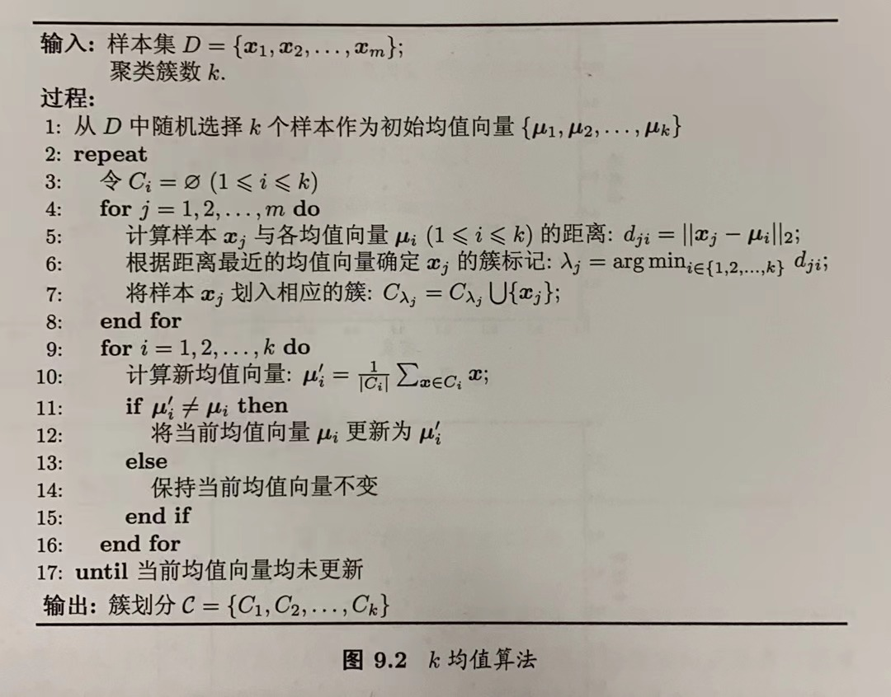
-   学习向量量化（Learning Vector Quantization，LVQ）

    LVQ假设数据样本带有类别标记，学习过程利用样本的这些监督信息来辅助聚类。

    给定样本集$ D=\{(x_1,y_1),(x_2,y_2),...,(x_m,y_m\}  $，每个样本$x_j$是由$n$个属性描述的特征向量$(x_{j1};x_{j1};...;x_{j1}),y_j\in y$是样本$x_j$的类别标记。LVQ的目标是学得一组$n$维原型向量$\{p_1,p_2,...,p_q\}$，每个原型向量代表一个聚类簇，簇标记$t_i\in y$。

    LVQ算法描述如下：第1行先对原型向量进行初始化，例如对第$q$个簇可从类别标记为$t_q$的样本中随机选取一个作为原型向量。第2-12行对原型向量进行迭代优化。每一轮迭代中，算法随机选取一个有标记样本，找出与其距离最近的原型向量，并根据两者的类别标记是否一致来对原型向量进行相应的更新。在第12行，若算法的停止条件以满足，则将当前原型向量作为最终结果返回。

    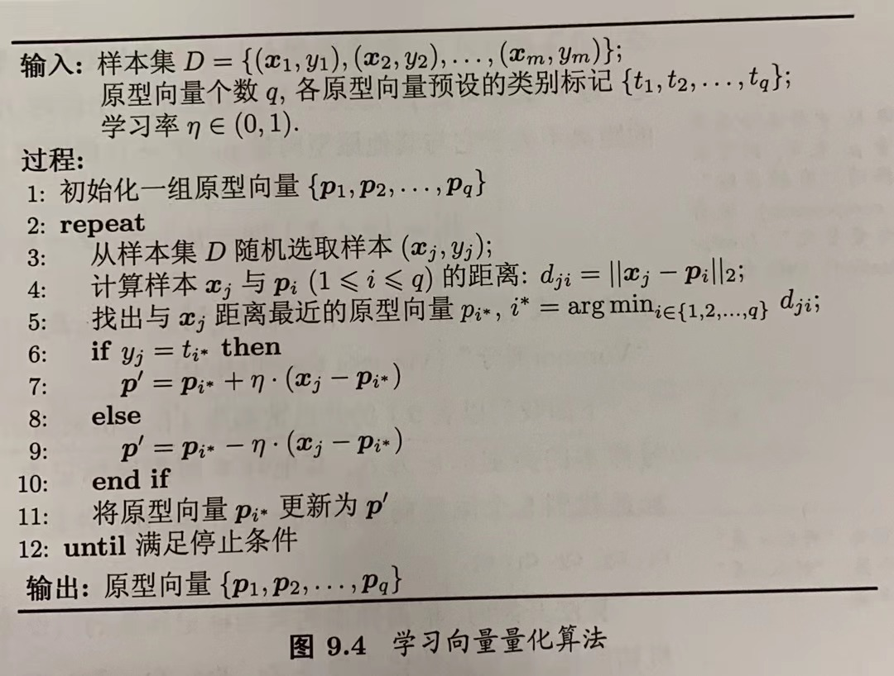

    LVQ的关键是第6-10行，即如何更新原型向量。直观来看，对样本$x_j$，若最近的原型向量$p_{i}*$与$x_j$的类别相同，则令$p_{i}*$向$x_j$的方向靠拢

    $p^{'}=p_i*+\eta·(x_j-p_i*)$    (25)

    $p^{'}$与$x_j$之间的距离为

    $||p^{'}-x_j||_2=||p_i*+\eta·(x_j-p_i*)-x_j||^2=(1-\eta)·||p_i*-x_j||_2$      (26)

    类似的，若$p_{i}*$与$x_j$的类别不同，则更新后的原型向量与x\_j之间的距离将增大为$(1+\eta)·||p_i*-x_j||_2$，从而远离$x_j$。

    学得一组原型向量$\{p_1,p_2,..,p_q\}$后，即可实现对样本空间$x$的簇划分。对任意样本$x$，它将被划入与其距离最近的原型向量所代表的簇中，即每个原型向量$p_i$定义了与之相关的一个区域$R_i$，该区域中的每个样本与$p_i$的距离不大于它与其他原型向量$p_{i'}$的距离，

    $R_i=\{x\in X|\ ||x-p_i||_2≤||x-p_{i'}||_2,i'≠i\}$      (27)
-   高斯混合聚类

    高斯混合聚类采用概率模型来表达聚类原型。

    多元高斯分布：对$n$维样本空间$X$中的随机向量$x$，若$x$服从高斯分布，其概率密度函数为

    $p(x)=\frac{1}{(2\pi)^{\frac{n}{2}}|\sum|^{\frac{1}{2}}}e^{-\frac{1}{2}(x-\mu)^T\sum^{-1}(x-\mu)}$    (28)

    其中，$\mu$是$n$维均值向量，$\sum$是$n\times n$的协方差矩阵。由式28可看出，高斯分布完全由均值向量$\mu$和协方差矩阵$\sum$这两个参数确定。将概率密度函数记为$p(x|\mu,\sum)$高斯分布，来明确显示高斯分布与相应参数的依赖关系。

    定义高斯混合分布：

    $p_M(x)=\sum_{i=1}^k\alpha_i·p(x|\mu_i,\sum_i)$     (29)

    该分布共有$k$个混合成分组成，每个混合成分对应一个高斯分布。其中$\mu_i$与$\sum_i$是第$i$个高斯混合成分的参数，而$\alpha_i>0$为相应的“混合系数”，$\sum_{i=1}^k\alpha_i=1$。

    假设样本的生成过程由高斯混合分布给出：首先，根据$\alpha_1,\alpha_2,...,\alpha_k$定义的先验分布选择高斯混合成分，其中$\alpha_i$为选择第$i$个混合成分的概率；然后根据被选择的混合成分的概率密度函数进行采样，从而生成相应的样本。算法描述如下：

    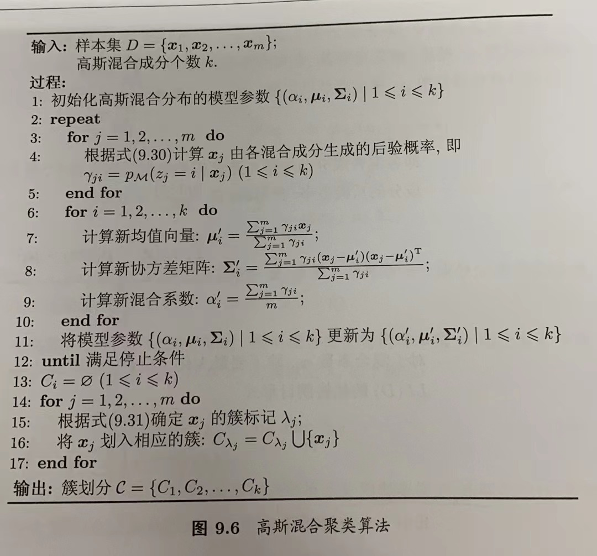

    算法第1行对高斯混合分布的模型参数进行初始化。然后在第2-12行基于EM算法，对模型参数进行迭代更新。若EM算法的停止条件满足（假如已达到最大迭代轮数，或似然函数$LL(D)$增长很少甚至不再增长），则在第14-17行根据高斯混合分布确定簇划分，在第18行返回最终结果。

## 9.4 密度聚类

密度聚类算法假设聚类结构能通过样本分布的紧密程度确定。通常情况下，密度聚类算法从样本密度的角度来考察样本之间的可连接性，并基于可连接样本不断扩展聚类簇以获得最终的聚类结果。

DBSCAN是著名的密度聚类算法，基于一组“邻域”参数（$\epsilon ,MinPts$）来刻画样本分布的紧密程度。给定数据集$D=\{x_1,x_2,...,x_m\}$，定义下面几个概念：

-   $\epsilon$-邻域：对$x_j\in D$，其$\epsilon$-邻域包含样本集D中与$x_j$的距离不大于$\epsilon$的样本，即$N_{\epsilon}(x_j)=\{x_i\in D|dist(x_i,x_j)≤\epsilon\}$;
-   核心对象：若$x_j$的$\epsilon$-邻域至少包含$MinPts$个样本，即$|N_{\epsilon}(x_j)|≥MinPts$，则$x_j$是一个核心对象；
-   密度直达：若$x_j$位于$x_i$的$\epsilon$-邻域中，且$x_i$是核心对象，则称$x_j$由$x_i$密度直达；
-   密度可达：对$x_i$与$x_j$，若存在样本序列$p_1,p_2,...,p_n$，其中$p_1=x_i,p_n=x_j$且$p_{i+1}$由$p_i$密度直达，则称$x_j$由$x_i$密度可达；
-   密度相连：对$x_i$与$x_j$，若存在$x_k$使得$x_i$与$x_j$均由$x_k$密度可达，则称$x_i$与$x_j$密度相连。

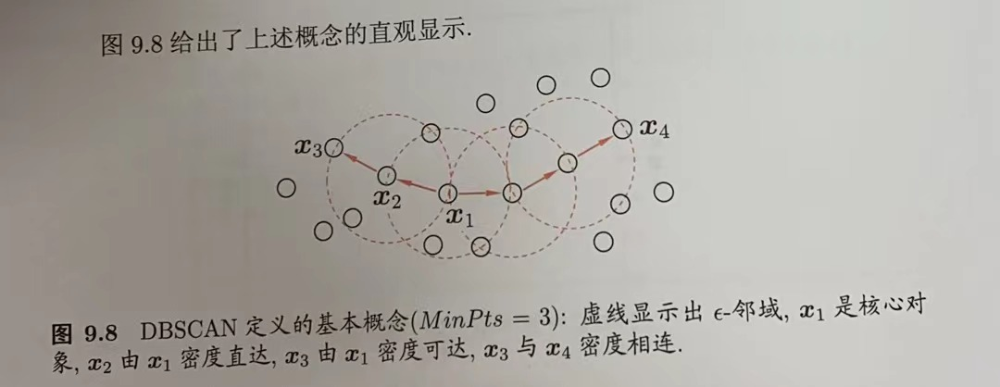

基于这些概念，DBSCAN将“簇”定义为：由密度可达关系导出的最大的密度样本相连集合。即给定邻域参数（$\epsilon ,MinPts$），簇$C\subseteq D$是满足以下性质的非空样本子集：

连接性：$x_i\in C,x_j\in C⇒x_i$与$x_j$密度相连     (39)

最大性：$x_i\in C,x_j$由$x_j$密度可达$⇒x_j\in C$    (40)

算法流程如下：先任选数据集中的一个核心对象为“种子”，再由此出发确定相应的聚类簇。在第1-7行中，算法先根据给定的邻域参数（$\epsilon ,MinPts$）找出所有核心对象；然后在第10-24行中，以任一核心对象为出发点，找出由其密度可达的样本生成聚类簇，直到所有核心对象均被访问过为止。

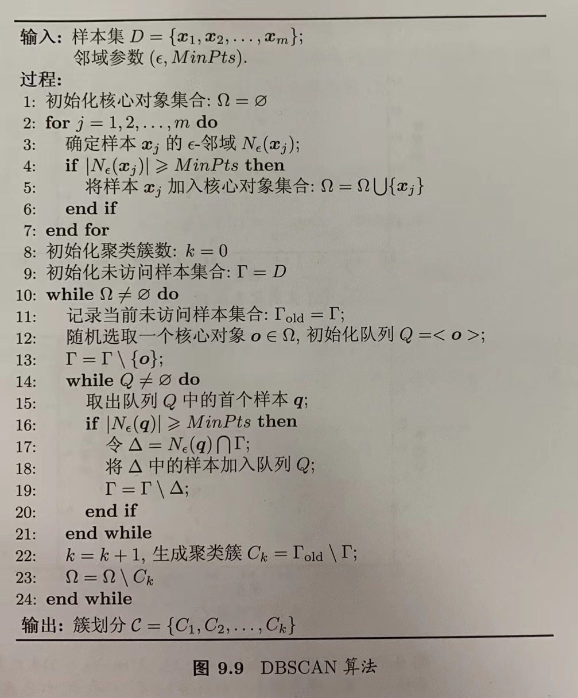

## 9.5 层次聚类

层次聚类试图在不同层次对数据集进行划分，从而形成树的聚类结构。数据集的划分可采用“自底而上”的聚合策略，也可采用“自顶向下”的分析策略。

AGNES是一种采用自底向上聚合策略的层次聚类算法。它先将数据集中的每个样本看作一个初始聚类簇，然后在算法运行的每一步找出距离最近的两个聚类簇进行合并，该过程不断重复，直到达到预设的聚类簇个数。算法的关键是如何计算聚类簇之间的距离。

最小距离：$d_{min}(C_i,C_j)=min_{x\in C_i,z\in C_j}\ dist(x,z)$    (41)

最大距离：$d_{max}(C_i,C_j)=max_{x\in C_i,z\in C_j}\ dist(x,z)$    (42)

平均距离：$d_{avg}(C_i,C_j)=\frac{1}{|C_i||C_j|}\sum_{x\in C_i}\sum_{z\in C_j}\ dist(x,z)$    (43)

最小距离是由两个簇的最近样本决定，最大距离是由两个簇的最远样本决定，平均距离是由两个簇的所有样本共同决定。

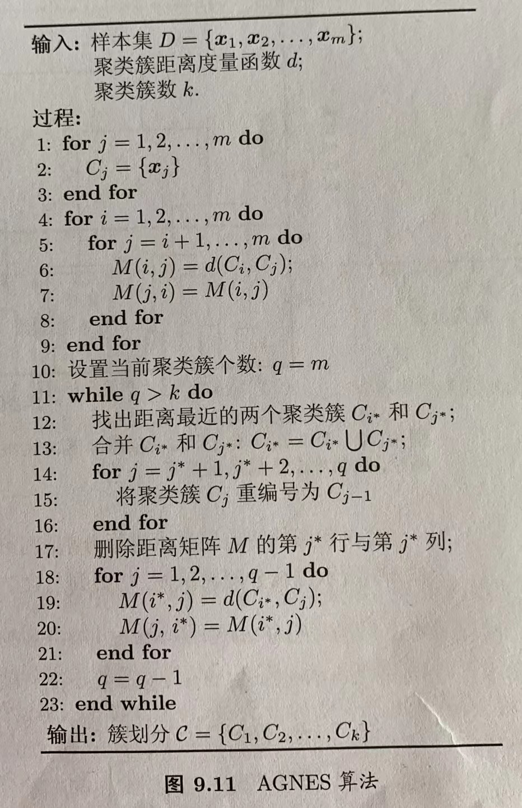

-   K-means
    -   有监督学习：训练样本**是带有标记信息**，其目的是：对带有标记的数据集进行模型学习，从而便于对新的样本进行分类或预测。
    -   无监督学习：训练样本的**标记信息是未知**的，目标是通过对无标记训练样本的学习来揭示数据的内在性质及规律，为进一步的数据分析提供基础。
    -   &#x20;"**聚类算法**"试图将数据集中的样本划分为若干个通常是不相交的子集，每个子集称为一个“簇”(cluster)，通过这样的划分，每个簇可能对应于一些潜在的概念或类别。
    -   K-means算法：k表示的是聚类为k个簇，means代表取每一个聚类中数据值的均值作为该簇的中心，或者称为质心，即用每一个的类的质心对该簇进行描述。

        1.簇个数 k 的选择

        一般是按照实际需求进行决定，或在实现算法时直接给定 k 值

        2\. 各个样本点到“簇中心”的距离

        欧氏距离

        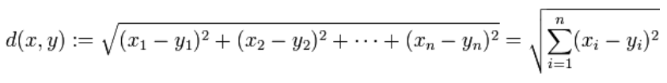

        曼哈顿距离

        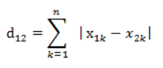

        3\. 根据新划分的簇，更新“簇中心”

        对于分类后的产生的k个簇，分别计算到簇内其他点距离均值最小的点作为质心

        4\. 重复上述2、3过程，直至"簇中心"没有移动
    -   数据预处理

        归一化
    -   欧几里得距离：指在m维空间中两个点之间的真实距离，在二维和三维空间中的欧氏距离就是两点之间的实际距离

        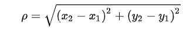

        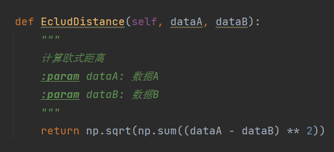
    -   初始化聚类中心

        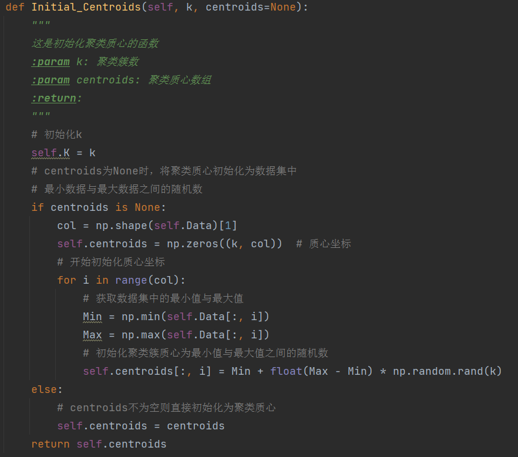
